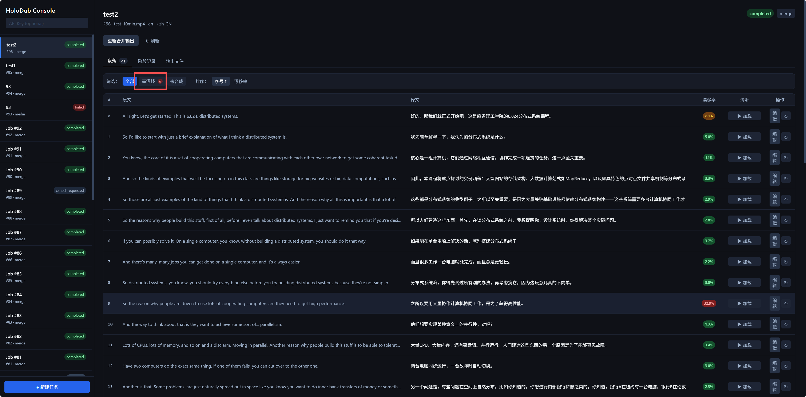

# HoloDub（幻读）

<div align="center">

  

  <h3>Holographic Audio Dubbing with Perfect Sync</h3>
  <p>全息音频配音 · 智能语义切分 · 时长精准对齐</p>

  <p>
    <a href="https://golang.org/">
      
    </a>
    <a href="https://www.python.org/">
      
    </a>
    <a href="#">
      
    </a>
    <a href="https://www.apache.org/licenses/LICENSE-2.0">
      
    </a>
  </p>

  <p>
    <a href="README.md">📖 English README</a>
  </p>

</div>

> Dub the whole performance, not just the words.  
> 不止翻译台词，而是重现整场表演。

## 🎬 运行案例 — 英语 → 中文（IndexTTS2，RTX 5080）

MIT 6.824 分布式系统完整课程（79 分钟，626 段）。零样本声纹克隆配音，无需任何训练。

**B 站观看**：[HoloDub 配音演示 — MIT 6.824 分布式系统课程（英→中）](https://www.bilibili.com/video/BV1vrwszEELd/)

流水线：`Faster-Whisper large-v3`（ASR）→ `Qwen-turbo`（翻译）→ `IndexTTS2 FP16`（零样本 TTS）· RTX 5080 总耗时约 52 分钟（79 分钟视频）

---

HoloDub 是一个 **面向创作者、自托管的视频翻译与配音工具箱**。

它主要服务于这样一群人：

- 想把 YouTube / B 站 / TikTok 视频搬运到其他语种平台的 UP / 博主  
- 做剪辑、二创、混剪的个人创作者、小团队  
- 想在本地 GPU 主机或云服务器上，用自己的模型做“私有译制”的字幕组 / Studio  

HoloDub 的目标不是“翻完字幕 + 随便套一条 AI 配音”，  
而是围绕整条时间轴，**重构音轨**，尽量接近「原生配音」的观看体验：

> 核心能力：**智能语义切分 + 时长感知 TTS（Duration-aware TTS）**

---

## ✨ 主要特性

### 🎬 时间轴优先的配音工作流

- **智能语义切分（Smart Semantic Split）**
  - 基于 Whisper 的 **单词级时间戳 ASR**。
  - 结合 Pyannote 的 VAD 静音检测。
  - 按“语义 + 停顿”拆分片段，而不是机械按固定时长切。
  - 可配置片段时长窗口（例如 2–15 秒 / 段）。

- **时长感知 TTS（Duration-aware TTS, IndexTTS2）**
  - 每个片段记录「原始时长」，作为 TTS 的硬约束输入。
  - 利用 IndexTTS2 的时长控制能力，使合成语音的长度尽量贴近原片段。
  - 必要时配合 `atempo` 等轻量时间拉伸手段，保证「音画尽量对齐」。

### 🗣 多说话人 + 自定义音色

- **说话人聚类（Speaker Diarization）**
  - 对整条人声做说话人识别和聚类（例如 `SPK_01`、`SPK_02`）。
  - 每个切分片段都会绑定一个说话人 ID。

- **自定义音色配置（Voice Profiles）**
  - `sample` 模式：  
    上传若干段参考音频，即可做 zero-shot 声纹克隆。
  - `checkpoint` 模式：  
    直接加载已有的 SoVITS / IndexTTS 风格检查点  
    （`.pth/.ckpt + .index + config`）。
  - 支持统一管理模型路径、说话人 ID、语种标签等元数据。

- **说话人与音色映射（Speaker → Voice Mapping）**
  - 面向每条视频任务（Job）：  
    为 `SPK_01 / SPK_02 / …` 分别选择不同的 Voice Profile。
  - 一个视频里，可以让主持人、嘉宾、旁白用完全不同的音色。
  - 修改映射后，可以只对受影响的片段重新生成配音。

### 🚀 创作者友好 & 自托管

- **想跑在哪儿就跑在哪儿**
  - 本地带 GPU 的桌面机 / NAS。
  - 云服务器上的单卡 / 双卡实例。
  - 默认不依赖任何第三方 SaaS。

- **默认单节点架构**
  - 简单的“一机版”拓扑：
    - Go 控制面（API + Worker）
    - Python ML 服务（GPU 推理）
    - PostgreSQL + Redis
  - 全部通过 Docker Compose 拉起来即可。

- **数据都在自己手里**
  - 视频 / 音频 / 文本 / 模型统一存放在 `/data` 目录。
  - 数据库只保存 **相对路径**（例如 `jobs/101/input.mp4`），迁移和备份更简单。

---

## 🧱 架构概览（简版）

> 不看这一段也可以用；  
> 想二开 / 魔改时，这一段能帮你快速搞清楚结构。

### 控制面（Go）

- 使用 Go 1.25+、Gin、GORM。
- 驱动任务在以下阶段流转：

  `media` → `separate` → `asr_smart` → `translate` → `tts_duration` → `merge`

- 在 PostgreSQL 中维护：
  - `jobs`：每条视频一个 Job。
  - `voice_profiles`：音色配置。
  - `speakers`：任务内的逻辑说话人。
  - `speaker_voice_bindings`：说话人与音色绑定关系。
  - `segments`：切分片段（翻译 & TTS 的最小单位）。

- 基于 Redis 做任务队列：
  - Job 级阶段任务（如 `job:123:stage:asr_smart`）。
  - 需要的时候可细化到 Segment 级别的 TTS 子任务。

- 对接 LLM（Qwen / DeepSeek 等）做翻译：
  - Prompt 会对「配音友好、长度接近」做约束，尽量避免译文过长或过短。

### 数据面（Python / GPU）

- 使用 Python 3.10+、FastAPI、PyTorch。
- 提供全局 GPU 锁 / 信号量，避免 OOM。
- 使用模型注册表管理：
  - Demucs / UVR5：人声 / 伴奏分离。
  - Faster-Whisper：ASR + 单词级时间戳。
  - Pyannote：VAD + 说话人识别。
  - IndexTTS2：时长感知 TTS。

- 通过 HTTP 提供接口，例如：
  - `POST /asr/smart_split`：
    - 输入：`audio_path`（相对路径）、最小/最大片段时长。
    - 输出：包含 `start_ms` / `end_ms` / `text` / `speaker_label` / `split_reason` 的片段列表。
  - `POST /tts/run`：
    - 输入：译文、`target_duration_sec`、`voice_config`、`output_relpath`。
    - 输出：音频保存路径 + 实际生成时长。

### 存储与路径约定

- 宿主机 `./data` 挂载为所有容器内的 `/data`。
- 数据库只保存相对路径（例如 `jobs/101/input.mp4`）。
- 应用运行时通过 `DATA_ROOT` 环境变量组装绝对路径。

---

## 📊 数据模型要点

- **jobs**：一条完整视频任务的生命周期。
- **voice_profiles**：抽象“音色配置”的元信息。
- **speakers**：单个任务内部的逻辑说话人（`SPK_01`、`SPK_02` 等）。
- **speaker_voice_bindings**：`speaker_id` → `voice_profile_id` 的映射。
- **segments**：
  - 包含 `start_ms` / `end_ms` / `original_duration_ms`。
  - `src_text`（ASR 文本）与 `tgt_text`（翻译文本）。
  - `tts_audio_path` / `tts_duration_ms`。
  - `split_reason`（通过标点、静音、最大时长等规则切分）。

---

## 🚦 当前状态

- [x] 架构与数据模型设计完成
- [x] 说话人与音色映射抽象完成
- [x] Go 控制面（API + Worker）
- [x] Python ML 服务（FastAPI）
- [x] 烟测模式端到端（mock / ffmpeg_stub / silence）
- [x] **真实 ASR**：Faster-Whisper large-v3，GPU 加速，词级时间戳
- [x] **真实翻译**：OpenAI 兼容接口（已测 qwen-turbo / DeepSeek）
- [x] **真实 TTS（过渡方案）**：Edge-TTS（微软，免费，中文自然语音，含 atempo 时长对齐）
- [x] GPU 直通（NVIDIA Container Toolkit + Docker Compose `deploy.devices`）
- [x] **IndexTTS2 内联集成**：`indextts2-inference` 集成进 `ml-service`，零样本声纹克隆
- [x] **IndexTTS2 真实推理验证**：英语 → 中文，RTF 1.47x（RTX 5080）
- [x] **asyncio 阻塞 bug 修复**：所有 ML 路由改用 `run_in_executor`，GPU 推理期间 healthz 保持响应
- [x] **时长感知翻译**：第一遍翻译携带基于片段时长计算的字数约束；TTS 音频溢出超出尾随静音 gap 时触发 Kimi-k2.5 再翻译
- [x] **漂移率驱动再翻译（≤6%）**：当 `|实际 − 目标| / 目标 > 6%` 时触发再翻译；最多 10 次，每次将上一轮文本、时长、漂移注入 prompt；达标或达上限后停止
- [x] **彻底去除 atempo**：时长对齐改为 gap 借用 + 再翻译循环，不再产生速度失真
- [x] **ASR 切分优化**：仅句尾标点触发切分，最少 5 词，800ms 静音阈值，短段后处理合并；默认最小 4s / 最大 20s
- [x] **amix 音量 bug 修复**：所有 amix 加 `normalize=0`；此前多段视频音量被除以段数（81 段时衰减 38 dB）
- [x] **ffmpeg 分批 merge**：每批最多 30 段，避免 `filter_complex` 在大视频上的 O(N²) 卡死；merge 阶段 lease 冲突时任务重新入队，不再丢失
- [x] **TTS 结果即时入库**：每段合成后立即写 DB，超时重试只处理未完成的段
- [x] **TTS 并发**：Worker 端 `TTS_CONCURRENCY=2` 同时发送请求；ml-service `GPU_CONCURRENCY=2` 支持 2 路并行 GPU 推理，提升吞吐
- [x] **79 分钟完整视频验证**：626 段，英语 → 中文，完整流水线端到端跑通
- [ ] 真实人声 / 伴奏分离（Demucs，需 `ML_PYTHON_EXTRAS=real`）
- [ ] 说话人分离（Pyannote，需 HuggingFace token）
- [x] **BigVGAN CUDA kernel 在 Blackwell / sm_120 上编译失败**：改用 devel 镜像 + 去掉未使用的 `#include <cuda_profiler_api.h>` + 构建时预编译 `.so` 烤进镜像层；RTX 5080 现已使用原生 CUDA kernel
- [x] **IndexTTS2 启动时预加载模型**：当 `INDEXTTS2_INLINE=true` 时，ml-service 启动即后台加载，首次 TTS 不再卡 6 分钟
- [ ] 使用中文参考音频改善韵律（当前默认使用英文片段，导致轻微语速不一致）

欢迎一起参与开发、提 Issue / PR。

---

## ▶ 运行当前原型

### 前置条件

- **Docker Desktop** 已安装并运行（Windows 使用 WSL2 后端）
- NVIDIA GPU 用户需额外安装 **NVIDIA Container Toolkit**（Docker Desktop 自带 nvidia runtime 支持时可跳过）

### 模式一：烟测（无需 GPU / API Key）

```powershell
Copy-Item .env.example .env
docker compose up --build -d
```

默认配置为 mock 后端，无需任何外部依赖，可验证整条流水线。

```powershell
# 提交测试任务
$body = '{"input_relpath":"input-smoke.mp4","target_language":"zh","auto_start":true}'
Invoke-RestMethod -Uri "http://127.0.0.1:8080/jobs" -Method POST -ContentType "application/json" -Body $body
```

打开 **http://localhost:8080/ui/** 查看进度，输出在 `data/jobs/<id>/output/final.mp4`。

### 模式二：接入真实后端（推荐）

#### 第一步：翻译（只需 API Key）

在 `.env` 中填写：

```env
TRANSLATION_PROVIDER=openai_compatible
OPENAI_BASE_URL=https://api.deepseek.com/v1   # 或阿里云 / OpenAI 等任意兼容接口
OPENAI_API_KEY=sk-xxxxxx
OPENAI_MODEL=deepseek-chat
```

推荐 **DeepSeek**（国内可访问、极低价格、中文效果好）。

#### 第二步：真实 ASR + TTS（需要 GPU）

在 `.env` 中修改：

```env
ML_PYTHON_EXTRAS=real
ML_ASR_BACKEND=faster_whisper
FASTER_WHISPER_MODEL=large-v3     # 推荐；显存 < 6GB 可用 medium
ML_TTS_BACKEND=edge_tts           # 免费，无需 API key，支持多种中文音色
```

重建 ml-service 镜像（首次约 10 分钟，主要是下载 PyTorch）：

```powershell
docker compose build ml-service
docker compose --env-file .env up -d
```

> ⚠️ **重要**：务必用 `--env-file .env` 或确保环境变量 `COMPOSE_ENV_FILE` 未被设置为 `.env.example`，否则容器会读取旧配置。

#### 第三步：Whisper 模型缓存（避免每次重启重新下载）

首次运行时，ml-service 会自动从 HuggingFace 下载 Whisper 模型（large-v3 约 3GB）。  
为避免每次重启容器都重新下载，`docker-compose.yml` 已将 `./hf-cache` 挂载到容器的 HuggingFace 缓存目录：

```
./hf-cache:/root/.cache/huggingface
```

模型一旦下载到 `hf-cache/`，后续重启无需重复下载。

#### 可选：说话人分离（Pyannote）

1. 在 HuggingFace 上接受 [pyannote/speaker-diarization-3.1](https://huggingface.co/pyannote/speaker-diarization-3.1) 的许可协议
2. 生成 Access Token：https://hf.co/settings/tokens
3. 在 `.env` 中填写：

```env
ML_VAD_BACKEND=pyannote
PYANNOTE_AUTH_TOKEN=hf_xxxxxx
```

### 常用命令

```powershell
docker compose ps                         # 查看服务状态
docker compose logs -f worker             # 查看 worker 日志
docker compose logs -f ml-service         # 查看 ML 服务日志（含模型加载进度）
docker compose down                       # 停止并移除容器
docker compose --env-file .env up -d      # 显式指定 .env 重启（推荐）
```

### Edge-TTS 音色选项（过渡方案）

> Edge-TTS 是当前的**临时 TTS 方案**，目的是在 IndexTTS2 接入之前验证完整的流水线。  
> 它不支持零样本声纹克隆，所有说话人都使用相同的预设音色。

默认音色为 `zh-CN-XiaoxiaoNeural`（女声）。可在 `.env` 中设置 `EDGE_TTS_VOICE` 更换：

| 音色 | 风格 |
|------|------|
| `zh-CN-XiaoxiaoNeural` | 女声，自然对话（默认） |
| `zh-CN-YunxiNeural` | 男声，新闻播报 |
| `zh-CN-YunjianNeural` | 男声，激昂有力 |
| `zh-TW-HsiaoChenNeural` | 台湾女声 |

---

## 🎙 IndexTTS2 零样本配音（已可用）

[IndexTTS2](https://github.com/index-tts/index-tts)（Bilibili 发布，Apache 2.0）是 HoloDub 的核心 TTS 后端。  
`indextts2-inference` 已**集成并完成代码级验证**，可在 `ml-service` 内直接加载模型。

### 核心能力

**1. 时长控制**（配音最关键的能力）  
- `max_mel_tokens` 根据**译文字数**估算（实测约 50 AR tokens/秒、13.5 tokens/汉字），仅留 5% 余量——不依赖目标时长。字数驱动的上限可防止模型因预算宽裕而拖慢语速。
- `max_allowed_sec = target_sec + 下一段前的静音 gap`，作为硬上限传入适配器，确保音频不超出可用静音窗口。
- 音频溢出进入 gap：直接接受（自然占用静音，无音质损失）。
- 溢出超出 gap（会覆盖下一段音频）：触发 Kimi-k2.5 再翻译压缩字数（最多 `RETRANSLATION_MAX_ATTEMPTS` 次）。
- **完全不使用 `atempo`**：通过再翻译 + gap 借用实现对齐，不产生速度失真。

**2. 零样本声纹克隆**  
- 只需 3~10 秒参考音频，无需训练，即可克隆任意说话人音色
- 结合 HoloDub 的 **Voice Profile** 体系：上传参考音频 → 绑定到 `SPK_01` / `SPK_02` → 不同说话人各有独立克隆音色

**3. 情感感知合成**  
- 音色与情感解耦，可用 A 的声音表达 B 的情绪
- `use_emo_text=true`（默认开启）：Qwen3 微调模型自动从翻译文本推断 8 维情感向量
- 愤怒的台词自动用愤怒的语气合成，无需手动标注

### 启用 IndexTTS2 内联模式

**前置条件**：需要 GPU + 已构建 `ML_PYTHON_EXTRAS=real` 镜像。

```env
# .env
ML_TTS_BACKEND=indextts2
INDEXTTS2_INLINE=true

# 可选：本地模型路径（留空则首次运行自动从 HuggingFace 下载）
INDEXTTS2_MODEL_DIR=/data/models/indextts2

# 可选：注意力后端（留空使用默认 sdpa，Ampere/Hopper 可选 sage/flash）
INDEXTTS2_ATTN_BACKEND=

# 从翻译文本自动推断情感（推荐开启）
INDEXTTS2_USE_EMO_TEXT=true

# 当某个说话人未绑定 VoiceProfile 时的兜底参考音频
INDEXTTS2_DEFAULT_VOICE_RELPATH=voices/default.wav
```

重启服务（不需要重新构建镜像）：

```powershell
docker compose --env-file .env up -d
```

**首次运行**：IndexTTS2 模型（约 3~5 GB）会自动从 HuggingFace 下载到 `./hf-cache`，后续启动无需重复下载。

### 配置零样本声纹克隆

```powershell
# 1. 将参考音频放入 data/voices/（容器内路径 /data/voices/）

# 2. 通过 API 创建 VoiceProfile
$body = @{
    name = "主持人音色"
    mode = "sample"
    language = "zh"
    sample_relpaths = @("voices/host_ref.wav")
} | ConvertTo-Json
Invoke-RestMethod -Uri "http://localhost:8080/voice-profiles" -Method Post -ContentType "application/json" -Body $body

# 3. 将 SPK_01 绑定到该 VoiceProfile
$body = @{ bindings = @(@{ speaker_label = "SPK_01"; voice_profile_id = <profile_id> }) } | ConvertTo-Json
Invoke-RestMethod -Uri "http://localhost:8080/jobs/<job_id>/bindings" -Method Put -ContentType "application/json" -Body $body
```

### 其他接入模式（无本地 GPU 时可用）

**HTTP 模式**（将 IndexTTS2 作为独立旁路服务）：
```env
ML_TTS_BACKEND=indextts2
INDEXTTS2_ENDPOINT=http://your-indextts2-service:8000/tts
```

**命令模式**（调用本地脚本）：
```env
ML_TTS_BACKEND=indextts2
INDEXTTS2_COMMAND=python run_tts.py --text "{text}" --duration "{duration}" --output "{output}"
```

### 待完成

- [ ] `emo_audio_prompt` 跨说话人情感迁移支持
- [ ] 单段情感手动覆盖（当前依赖自动文本推断）

---

## 🎬 运行案例

完整配音演示可在 B 站观看：[BV1vrwszEELd](https://www.bilibili.com/video/BV1vrwszEELd/)

### 60 秒短片（9 段）

**输入**：MIT 6.824 分布式系统课程节选，英语，60 秒  
**流水线**：Faster-Whisper large-v3 → Qwen-turbo → IndexTTS2（零样本）  
**硬件**：RTX 5080，Docker + WSL2

| 阶段 | 时间 |
|------|------|
| IndexTTS2 冷启动（首次任务） | **~6 分钟** |
| 单段推理（热态） | **3.6 秒**（GPT 1.06s + S2Mel 0.70s + BigVGAN 0.10s） |
| 完整 60 秒任务 | **~7 分钟** |
| 实时率（RTF） | **1.47x** |

### 完整 79 分钟课程

**输入**：MIT 6.824 完整讲座视频，英语，79 分钟，946 MB  
**流水线**：同上  
**切分**：626 段，平均 6.9 秒（最短 4s，最长 21.5s）

| 阶段 | 大约耗时 |
|------|---------|
| ASR（Faster-Whisper large-v3） | ~8 分钟 |
| 翻译（Qwen-turbo，626 段） | ~12 分钟 |
| TTS（IndexTTS2，热态） | ~36 分钟 |
| 合并（分批 ffmpeg，21 批 × 30 段） | ~5 分钟 |
| **总计** | **~60 分钟** |

**时长精度**：626 段平均漂移 < 1%；3 段因溢出超出 gap 触发 Kimi-k2.5 再翻译。

**10 分钟短片（test_10min.mp4）**：约 81 段；漂移率驱动再翻译（目标 ≤6%，最多 10 次）使多数段落在 5% 以内；高漂移筛选可快速定位需人工精调的段落。

---

## ⚠️ 已知问题与社区求助

以下是真实硬件测试中发现的开放问题，欢迎贡献 PR！

### 1. ~~BigVGAN CUDA kernel 在 Blackwell / RTX 50 系列（sm_120）上编译失败~~ — 已修复 ✅

**原始现象**：`nvidia/cuda:12.8.0-runtime` 基础镜像不含 `nvcc`，BigVGAN 反混叠 CUDA 扩展在运行时无法 JIT 编译。

**修复方案**（`docker/ml.Dockerfile`）：

1. **切换基础镜像**：从 `nvidia/cuda:12.8.0-runtime-ubuntu22.04` 改为 **`nvidia/cuda:12.8.0-devel-ubuntu22.04`**，devel 版本包含完整 CUDA 编译工具链（`nvcc`、`cuda_runtime.h`、`cusparse.h` 等所有头文件）。镜像增大约 1 GB，但编译可靠。

2. **去掉未使用的头文件引用**：BigVGAN 的 `.cu` 源码包含 `#include <cuda_profiler_api.h>`，该头文件即使在 devel 镜像中也不存在，且从未被实际调用。在 Dockerfile 中用 `sed` 将其注释掉：
   ```dockerfile
   RUN find /usr/local/lib/python3.11/dist-packages/indextts -name "*.cu" \
        -exec sed -i 's|#include <cuda_profiler_api.h>|// removed (unused)|g' {} \;
   ```

3. **构建时预编译并缓存**：`docker/precompile_bigvgan.py` 在 `docker build` 阶段执行，为 `7.5;8.0;8.6;8.9+PTX;12.0` 各架构编译扩展，生成的 `.so` 文件烤进镜像层。每次容器启动时直接加载缓存的 kernel，无需运行时编译。

**RTX 5080 实测结果**：BigVGAN 现在使用原生 CUDA kernel。结合 `use_fp16=True`，TTS 吞吐量相比 FP32 + torch 回退提升约 **2.5 倍**（626 段 / 79 分钟视频实测：3.08 秒/段 vs 约 7.7 秒/段）。

### 2. IndexTTS2 冷启动（已缓解）

**现象**：加载全部组件（GPT 3.3 GB + S2Mel 1.1 GB + BigVGAN + wav2vec2bert + CAMP++ + NeMo 文本处理器）在 RTX 5080 上约 **6 分钟**。

**已实现缓解**：
- 当 `INDEXTTS2_INLINE=true` 且 `ML_TTS_BACKEND=indextts2` 时，ml-service 启动即**后台预加载**，首次 TTS 请求不再阻塞 6 分钟
- `/healthz` 返回 `tts_warmup_status`：`idle` | `loading` | `ready` | `error`
- Go API 提供 `GET /ml-health` 代理 ml-service 状态
- Web UI 在 `tts_warmup_status === "loading"` 时显示「TTS 模型预热中…」提示条

### 3. HuggingFace XetHub 大文件下载在 Docker 内停滞

**现象**：通过 XetHub 协议（`hf-xet`）的 `snapshot_download` 会在 2~3 个大 blob 上停滞（`.incomplete` 文件不再增长）。

**解决办法**：设置 `HF_HUB_DISABLE_XET=1` 并用标准 HTTP 下载：

```python
import os, requests
os.environ["HF_HUB_DISABLE_XET"] = "1"
from huggingface_hub import snapshot_download
snapshot_download("IndexTeam/IndexTTS-2", token=os.environ.get("HF_TOKEN"))
```

或直接用 requests 流式下载单个卡住的文件（如 `gpt.pth`）：

```python
import requests, os
url = "https://huggingface.co/IndexTeam/IndexTTS-2/resolve/main/gpt.pth"
headers = {"Authorization": f"Bearer {os.environ['HF_TOKEN']}"}
with open("gpt.pth", "wb") as f:
    for chunk in requests.get(url, headers=headers, stream=True).iter_content(8*1024*1024):
        f.write(chunk)
```

---

### .env 配置说明

| 变量 | 烟测默认 | 真实后端 |
|------|----------|----------|
| `TRANSLATION_PROVIDER` | `mock` | `openai_compatible` |
| `ML_ASR_BACKEND` | `mock` | `faster_whisper` |
| `ML_TTS_BACKEND` | `silence` | `edge_tts` → `indextts2` |
| `ML_VAD_BACKEND` | `none` | `pyannote`（可选）|
| `ML_SEPARATOR_BACKEND` | `ffmpeg_stub` | `demucs`（可选）|
| `ML_PYTHON_EXTRAS` | 空 | `real` |
| `INDEXTTS2_INLINE` | `false` | `true`（当 `ML_TTS_BACKEND=indextts2` 时）|
| `INDEXTTS2_MODEL_DIR` | 空（自动下载）| `/data/models/indextts2` |
| `INDEXTTS2_USE_EMO_TEXT` | `false` | `true`（需 Qwen3 情感模型）|
| `INDEXTTS2_DEFAULT_VOICE_RELPATH` | 空 | `voices/ref.wav`（**建议用中文音频**，效果更好）|
| `RETRANSLATION_ENABLED` | `true` | `true` / `false` |
| `RETRANSLATION_DRIFT_THRESHOLD` | `0.06` | 最大允许漂移（6%）；超出则触发再翻译 |
| `RETRANSLATION_MAX_ATTEMPTS` | `10` | 每段最多再翻译次数 |
| `TTS_CONCURRENCY` | `2` | Worker 端 TTS 并发请求数 |
| `GPU_CONCURRENCY` | `2` | ml-service 端 GPU 推理并发数（需约 16GB 显存）|
| `STAGE_TIMEOUT_SECONDS` | `14400` | 超长视频可适当调大 |

---

## 🛠 技术栈

- **控制面**：Go, Gin, GORM, Redis, PostgreSQL  
- **数据面**：FastAPI, PyTorch, Demucs/UVR5, Faster-Whisper, Pyannote, IndexTTS2  
- **编排**：Docker Compose  
- **翻译**：Qwen / DeepSeek / 其他可插拔 LLM 提供方  
- **Web UI**（一期）：Vue 3 + Vite + Tailwind CSS — 深色侧边栏，段落漂移审查，内联 TTS 编辑与重合成  

---

## 🖥 Web UI — 段落精调审查

操作台（`/ui/`）已重构为 Vue 3 SPA，采用 **Open WebUI 风格**的深色侧边栏布局。



*段落表格：漂移率徽章、内联编辑、高漂移筛选 — 逐段审查与精调译文。*

### 一期功能（当前分支：`feature/ui-segment-review`）

| 功能 | 说明 |
|------|------|
| **Job 侧边栏** | 实时任务列表 + 状态徽章，每 10 秒自动刷新 |
| **段落表格** | 全部段落：原文、译文、漂移率徽章 |
| **漂移率徽章** | 绿色 < 5 % · 黄色 5–15 % · 红色 > 15 % |
| **音频试听** | 每个已合成段落内联 `<audio>` 播放器（懒加载 blob） |
| **内联编辑** | 点击编辑 → 修改译文 → 仅保存 或 保存 + 重新合成 |
| **筛选 / 排序** | 按 全部 / 高漂移 / 未合成 筛选 · 按序号或漂移率排序 |
| **重新合并** | 编辑后触发 merge 阶段重试，重新生成 `final.mp4` |

### 本地构建 UI

```bash
cd ui
npm install
npm run build
# 输出到 internal/ui/static/（由 go:embed 打包进二进制）
```

开发热更新模式：
```bash
cd ui
npm install
npm run dev
# Vite 开发服务器：http://localhost:5173/
```

### 二期规划（待办）

- **原始音频对比**：原声切片 vs TTS 音频并排播放（从 `vocals.wav` 按时间戳切片）
- **批量重合成**：多选段落 + 批量 Rerun 按钮
- **键盘快捷键**：`J`/`K` 上下段，`Space` 播放，`E` 编辑
- **波形可视化**：集成 WaveSurfer.js 进行精确音频检视
- **段落质量标注**：标记 good / bad / skip，持久化到 segment meta
- **说话人绑定 UI**：直接在段落表格中分配音色档案

---

## 🛠 技术栈

- **控制面**：Go、Gin、GORM、Redis、PostgreSQL  
- **ML 服务**：FastAPI、PyTorch、Demucs/UVR5、Faster-Whisper、Pyannote、IndexTTS2  
- **编排**：Docker Compose  
- **翻译**：Qwen / DeepSeek / 其他可插拔 LLM 提供方  
- **Web UI**：Vue 3、Vite、Tailwind CSS  

---

## 📜 License

Apache 2.0
