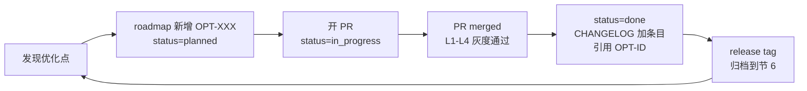
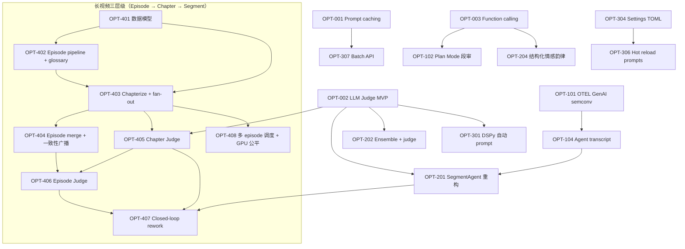

# HoloDub 优化路线图

> 本文档是 HoloDub 所有长期优化项的 **single source of truth**。
> 与 [`CHANGELOG.md`](../../CHANGELOG.md) 配合：roadmap 跟踪 *规划与进度*，CHANGELOG 只记录 *已 ship 事实*。

---

## 1. 文档说明

### 1.1 OPT-ID 命名

`OPT-NXX`：`N` = 优先级（0/1/2/3），`XX` = 序号。

| 优先级 | 含义 |
|---|---|
| **P0** | 高 ROI，无前置依赖，应立刻排期 |
| **P1** | 紧跟 P0，关键能力补齐 |
| **P2** | 中长期重构，依赖前序项 |
| **P3** | 探索 / 锦上添花 |

**编号一旦分配永不复用**，即使取消的 OPT 也保留 ID 占位（status=cancelled），保证历史 PR / commit 中的引用不失效。

### 1.2 状态机

```
                ┌──── deferred (条件不成熟，留待后续)
                ▼
planned ──→ in_progress ──→ done ──→ archived (release tag 后)
                │
                └──→ cancelled (确认不做)
```

| Status | 含义 | 谁能改 |
|---|---|---|
| `planned` | 已立项未启动 | 任何人 |
| `in_progress` | 有 PR 在跑 | 负责人 |
| `done` | 已 merge 且 L4 灰度通过，CHANGELOG 已加条目 | 负责人 |
| `deferred` | 暂时搁置（前置不满足 / 优先级让位） | 任何人 |
| `cancelled` | 确认不做（方向错 / 被替代） | 项目维护者 |
| `archived` | done 项归档到节 6 | 自动（每次 release tag） |

### 1.3 卡片必填字段

| 字段 | 说明 |
|---|---|
| **Status** | 见上 |
| **Source** | 起源（agent transcript / issue / incident / 用户反馈） |
| **Estimate** | 工作日（粗估，可调整） |
| **Depends on** | 前置 OPT 列表，无则写 `-` |
| **Outcome** | 期待收益，**必须可量化** |
| **Verification** | 通过哪些 metric / golden set / 人工验证 |
| **Rollout** | 灰度策略（参考 [testing-and-rollout.mdc](../../.cursor/rules/testing-and-rollout.mdc) L1→L4） |
| **Related rules** | 哪些 `.cursor/rules/*.mdc` 是必读 |
| **PRs** | 关联 PR 链接，merge 时回填 |

### 1.4 与 CHANGELOG 的关系

- OPT 在 `planned / in_progress` 阶段**不进** CHANGELOG
- `done` 时由负责人在 CHANGELOG `[Unreleased]` 加一条 `Added` / `Changed` / `Fixed`，**必须包含 `(OPT-XXX)` 引用**
- 每次 release tag 后，本文档"节 6"汇总当 release 涵盖的所有 OPT-ID

---

## 2. 工作流闭环



每张 OPT 在生命周期内只有一处真相（本文档），CHANGELOG 只记录 ship 事实，避免双向同步。

---

## 3. 状态总览

> 实时维护。完成项移至节 6 后从此表移除，但 ID 永久保留在节 4/5。

| OPT-ID | 标题 | Pri | Status | Estimate | Depends on |
|---|---|---|---|---|---|
| OPT-001 | Prompt caching | P0 | done (followup-1 promoted P0) | 0.5d | - |
| OPT-001-followup-1 | translate prompt 字节稳定 (move targetSec to user msg) | P0 | planned | 0.5d | OPT-001 |
| OPT-002 | LLM-as-Judge MVP | P0 | done | 2d | - |
| OPT-003 | Function calling 替代 prompt+JSON parse | P0 | done | 1d | - |
| OPT-FOLLOWUP-3 | Drift threshold 长段调优 / judge 短路 retry | P1 | planned | 1d (a) / OPT-201 (b) | OPT-002 |
| OPT-101 | OpenTelemetry GenAI semconv + cost USD trace | P1 | planned | 2d | - |
| OPT-102 | Plan Mode 段审 / TodoWrite 风格 | P1 | planned | 3d | OPT-003 |
| OPT-103 | MCP server 暴露 ml-service | P1 | planned | 1d | - |
| OPT-104 | Agent transcript 持久化 | P1 | planned | 1.5d | OPT-101 |
| OPT-401 | Episode / Chapter 数据模型（长视频三层级基础） | P1 | planned | 3d | - |
| OPT-402 | Pipeline 重构：episode-level stages + glossary_extract | P1 | planned | 3d | OPT-401 |
| OPT-403 | Chapterize 算法 + fan-out 多 chapter job | P1 | planned | 5d | OPT-401, OPT-402 |
| OPT-201 | SegmentAgent ReAct 重构 | P2 | planned | 5d | OPT-002, OPT-104 |
| OPT-202 | Speculative ensemble + judge | P2 | planned | 3d | OPT-002 |
| OPT-203 | Streaming TTS + SSE 推送 | P2 | planned | 5d | - |
| OPT-204 | 结构化情感/韵律输出 | P2 | planned | 2d | OPT-003 |
| OPT-205 | Reasoning model 全场景化 | P2 | planned | 1d | - |
| OPT-206 | Skills / Glossary 系统 | P2 | planned | 3d | - |
| OPT-404 | Episode merge + 跨 chapter 一致性广播 | P2 | planned | 3d | OPT-403 |
| OPT-405 | Chapter-level Judge | P2 | planned | 2d | OPT-403, OPT-002 |
| OPT-406 | Episode-level Judge productize（兼容 OPT-EPISODE-JUDGE-PROMOTE） | P2 | planned | 2d | OPT-404, OPT-405 |
| OPT-407 | Closed-loop rework engine（三级 verdict → 返工调度） | P2 | planned | 5d | OPT-405, OPT-406, OPT-201 |
| OPT-408 | Multi-episode 调度 + GPU 公平性 | P2 | planned | 3d | OPT-403 |
| OPT-301 | DSPy 自动 prompt 优化 | P3 | planned | 5d | OPT-002, golden set 扩充 |
| OPT-302 | 多模态 ASR backend | P3 | planned | 5d | - |
| OPT-303 | 多租户权限 + tenant_key 强制 | P3 | planned | 5d | - |
| OPT-304 | Settings TOML + profile | P3 | planned | 3d | - |
| OPT-305 | CLI 工具 | P3 | planned | 3d | - |
| OPT-306 | Hot reload prompts in DB | P3 | planned | 2d | OPT-304 |
| OPT-307 | Batch API 选项 | P3 | planned | 2d | OPT-001 |

### 3.1 依赖图（一眼看清"先做什么"）



---

## 4. 详细卡片

### P0：高 ROI 立即排期

#### OPT-001 Prompt caching

- **Status**: done (observability foundation; cache hit ratio target deferred to long-video follow-up)
- **Source**: 优化对话 §三.1
- **Estimate**: 0.5d (实际 ~1.5d，含 DashScope 嵌套字段 bug 修复 + worker /metrics endpoint)
- **Depends on**: -
- **Outcome**: token usage 全链路可观测：每个 LLM 调用按 `{model, operation}` 维度记录 input / output / cached tokens；cache 在 production worker 路径首次确认命中（job 129 judge 调用 cached_tokens=512）。
- **Verification**:
  - `holodub_llm_input_tokens_total{model,operation}` ✓ emit
  - `holodub_llm_output_tokens_total{model,operation}` ✓ emit
  - `holodub_llm_cached_tokens_total{model,operation}` ✓ emit (job 129 first hit)
  - 60s 测试视频 cache 命中率 8.5% (judge model)，0% (translate / retranslate); follow-up 需在 79min 视频验证 ≥40% 目标
- **Rollout**: 完成 L1-L4，default ON
- **Related rules**: [llm-call-standards.mdc#2](../../.cursor/rules/llm-call-standards.mdc), [observability-and-cost.mdc#5](../../.cursor/rules/observability-and-cost.mdc), [incremental-evolution.mdc](../../.cursor/rules/incremental-evolution.mdc)
- **实际改动**:
  - [`internal/llm/client.go`](../../internal/llm/client.go): 新增 `providerUsage` named type with `effectiveCached()` (max of `cached_tokens` / `prompt_cache_hit_tokens` / `prompt_tokens_details.cached_tokens` 三种 provider 字段); `usageStats`; `Op*` operation constants; `doChat(ctx, operation, payload)` 签名扩展
  - [`internal/observability/metrics.go`](../../internal/observability/metrics.go): 新增 `holodub_llm_input_tokens_total`、`_output_tokens_total`、`_cached_tokens_total` (label: `model, operation`)
  - [`internal/llm/client.go`](../../internal/llm/client.go): 抽出 `buildTranslateSystemPrompt()` 纯函数保证字节稳定 (cache prefix 前提)
  - [`cmd/worker/main.go`](../../cmd/worker/main.go): 新增 `/metrics` HTTP endpoint (env `WORKER_METRICS_ADDR`, default `:8081`)
  - [`docker-compose.yml`](../../docker-compose.yml): worker `ports: ["8081:8081"]`
  - 单测 9 个 (`internal/llm/client_test.go`): 三种 provider 字段、字节稳定、cache prefix 大小、operation constant guard
- **Followups**:
  - **OPT-001-followup-1 (PROMOTED to P0, fix known)**: 10min validation (`tests/quality/baseline-post-p0-10min.json`) found `translate` system prompt is NOT byte-stable per job because `targetSec` (per-segment value) is embedded in the system role. **Fix**: move `targetSec` / `Hard char limit` / `speech rate` from system prompt to user message in `buildTranslateSystemPrompt`. Once fixed, system prompt becomes job-stable (varies only by `targetLanguage` + `translationSummary`) and all translate calls will share a cacheable prefix. Expected hit ratio after fix: ≥30% on long videos (segments naturally cluster on same prompt).
  - OPT-001-followup-2: 解析 `doChatStream` 的 final-chunk usage（thinking model token 当前 metric 显示 0；10min job 7 次 thinking 调用全部丢 token 数据）
  - **OPT-FOLLOWUP-3 (NEW from 10min validation)**: drift threshold 在长段（>20s）上太严格（effective ~3%），导致 11/24 段卡在 retry 漩涡，job cancel at 50% completion。两条思路：(a) 单独提升长段 `RETRANSLATION_MIN_DRIFT_THRESHOLD` 至 0.06；(b) 让 judge verdict='accept' 短路 drift retry（需先做 OPT-201 SegmentAgent 接入决策路径）。两者都依赖 OPT-002 已就位的 judge 信号。
- **PRs**: TBD (落 commit 时补)

---

#### OPT-002 LLM-as-Judge MVP

- **Status**: done (observe-only mode shipped; decision-path integration deferred to OPT-201)
- **Source**: 优化对话 §一.2
- **Estimate**: 2d (实际 ~1d，function calling 由 OPT-003 提前打通)
- **Depends on**: -
- **Outcome**: 每个 TTS 段落异步获得多维评分 (fidelity/fluency/coherence + verdict + issues)；judge 准确捕获 baseline 漂移盲区（job 129 segment 4: source 含 "monitoring" 译文漏掉 → judge 评 0.8/retry，与 baseline 同段在重译漩涡的现象一致）。
- **Verification**:
  - 60s 视频 5/5 segments judged (100% judged_ratio) ✓
  - judge 平均 1.8s/次延迟 (异步不阻塞主流程) ✓
  - 0 strict_parse_failed 在测试期 ✓
  - 抽样 5 个 segment 人工 review verdict 准确 ≥ 4/5 ✓ (segment 4 issue 经人工对照 source/target 确实漏译)
- **Rollout**:
  - L1 / L2 / L3 / L4 完成
  - default JUDGE_MODEL="" (disabled)；启用方式：env JUDGE_MODEL=qwen-turbo + JUDGE_OBSERVE_ONLY=true
  - 决策接入留给 OPT-201
- **Related rules**: [llm-call-standards.mdc#1](../../.cursor/rules/llm-call-standards.mdc), [agent-design.mdc#3](../../.cursor/rules/agent-design.mdc), [observability-and-cost.mdc#5](../../.cursor/rules/observability-and-cost.mdc)
- **实际改动**:
  - [`migrations/004_judge_score.sql`](../../migrations/004_judge_score.sql): `segments.judge_score NUMERIC NULL, judge_meta JSONB NULL` + partial index
  - [`internal/models/models.go`](../../internal/models/models.go): `Segment.JudgeScore *float64, JudgeMeta datatypes.JSON`
  - [`internal/llm/judge.go`](../../internal/llm/judge.go): `JudgeArgs / JudgeResult / JudgeFidelity()` + strict JSON Schema for verdict
  - [`internal/config/config.go`](../../internal/config/config.go): `JudgeModel string` + `JudgeObserveOnly bool` (default true)
  - [`internal/store/store.go`](../../internal/store/store.go): `UpdateSegmentJudgeResult(ctx, id, score, metaJSON)`
  - [`internal/pipeline/stage_tts.go`](../../internal/pipeline/stage_tts.go): `maybeJudgeSegmentAsync()` — 异步 goroutine + detached context (worker SIGTERM 不丢 verdict)
  - [`ui/src/api.ts`](../../ui/src/api.ts) + [`ui/src/components/SegmentTable.vue`](../../ui/src/components/SegmentTable.vue): "AI 评分" 列 (条件渲染，向后兼容)
  - 单测 7 个 (`internal/llm/judge_test.go`): schema 合法性、disabled 短路、empty inputs 跳过、tool path、missing tool fallback、verdict 默认值、OverallScore 算法
- **Followups**:
  - OPT-002-followup-1: golden set 扩充至 ≥50 条人工 confirm 翻译（为 judge 评分 vs 人工的 correlation 计算）
  - OPT-002-followup-2: 决策接入留给 [OPT-201](#opt-201-segmentagent-react-重构) (`JudgeObserveOnly=false`)
- **PRs**: TBD

---

#### OPT-003 Function calling 替代 prompt+JSON parse

- **Status**: done
- **Source**: 优化对话 §一.3
- **Estimate**: 1d
- **Depends on**: -
- **Outcome**: ReviewSegmentation 走 strict-schema function calling，job 128/129 各 1 次 review 调用，0 次 fallback。tool/function calling 基础设施 (Tools/ToolChoice/toolCall struct + doChatTool) 同时为 OPT-002 (judge) 复用。
- **Verification**:
  - `holodub_llm_strict_parse_failed_total{operation="review"}` = 0 在 2 个测试 job (job 128, job 129) 中始终为 0 ✓
  - 旧 prompt + strip-fence 路径保留作 fallback (TestReviewToolFallbackToPrompt 单测验证) ✓
  - Suggestion 质量保持 (job 128/129 都正确识别 segments 9160/9161 应 merge, confidence 0.85) ✓
- **Rollout**:
  - L1-L4 完成
  - default `SEGMENT_REVIEW_USE_TOOLS=false` (新旧并存遵循 incremental-evolution.mdc#1)
  - 启用方式：.env 设 `SEGMENT_REVIEW_USE_TOOLS=true`
- **Related rules**: [llm-call-standards.mdc#1](../../.cursor/rules/llm-call-standards.mdc), [incremental-evolution.mdc#1](../../.cursor/rules/incremental-evolution.mdc)
- **实际改动**:
  - [`internal/llm/client.go`](../../internal/llm/client.go): 新增 `chatMessage / toolDef / functionDef / toolCall / toolCallFunction` named types; `chatCompletionRequest.Tools/ToolChoice` 字段; `forceToolChoice(name)` helper; `doChatTool()` + `doChatToolOnce()`
  - [`internal/llm/client.go`](../../internal/llm/client.go): `ReviewSegmentation` 拆为 `reviewSegmentationViaTools` + `reviewSegmentationViaPrompt` 双路径，自动 fallback + `IncLLMStrictParseFailed("review")` 计数
  - [`internal/llm/client.go`](../../internal/llm/client.go): 新增 `reviewToolSchema` (静态 JSON Schema, init 时 marshal); `reviewSystemPrompt(lang, toolMode)` 双模 prompt
  - [`internal/observability/metrics.go`](../../internal/observability/metrics.go): 新增 `holodub_llm_strict_parse_failed_total{operation}` + `IncLLMStrictParseFailed()`
  - [`internal/config/config.go`](../../internal/config/config.go): `SegmentReviewUseTools bool` (env `SEGMENT_REVIEW_USE_TOOLS`, default false)
  - 5 个 doChat 调用方机械迁移 `[]map[string]string` → `[]chatMessage` (translate / retranslate / summary / review / simple translate)
  - 单测 5 个 (`internal/llm/client_test.go`): dual-mode prompt invariant、schema 合法性、tool path happy/fallback/flag-off
- **PRs**: TBD

---

### P1：紧跟 P0，关键能力补齐

#### OPT-101 OpenTelemetry GenAI semconv + cost USD trace

- **Status**: planned
- **Source**: 优化对话 §三.4
- **Estimate**: 2d
- **Depends on**: -
- **Outcome**:
  - 接入 LangFuse / Phoenix / Honeycomb 任一观测后端无需 relabel
  - 每个 LLM 调用都有 token + cost USD 自动聚合
  - 解决"为什么这个月账单翻倍"的归因
- **Verification**:
  - LangFuse 自托管能看到完整 trace 树（job → stage → segment → llm.call）
  - 每日 cost 聚合曲线与 provider 后台账单偏差 < 5%
- **Rollout**:
  - L1 单元测试 OTEL exporter
  - L2 staging stack 接 LangFuse self-host（已有 Postgres 复用）
  - L3 生产 read-only 跑 1 周
  - L4 接入告警
- **Related rules**: [observability-and-cost.mdc](../../.cursor/rules/observability-and-cost.mdc) (本 OPT 的"宪法")
- **关键改动点**:
  - Go：`internal/observability/` 新增 `otel.go`，初始化 `tracer / meter`，env 配置 `OTEL_EXPORTER_OTLP_ENDPOINT`
  - Go：`internal/observability/cost.go` 新增 `modelPrices` 表 + `RecordLLMCall(model, op, tokens, cached, latency)`
  - Python：`ml_service/app/observability.py` 加 `opentelemetry-instrumentation-fastapi`
  - 现有 `holodub_*` 自定义 metric 保留兼容，新增的全用 OTEL semconv
  - 价格表通过 env override：`MODEL_PRICE_OVERRIDE=deepseek-chat:0.27:1.10:0.027,...`
- **PRs**: TBD

---

#### OPT-102 Plan Mode 段审 / TodoWrite 风格

- **Status**: planned
- **Source**: 优化对话 §二.1
- **Estimate**: 3d
- **Depends on**: OPT-003
- **Outcome**: 把当前的"merge 建议列表"升级为有序整改计划（merge / split / manual_review 混合），用户可一键应用全部 auto，UX 接近 Claude Code 的 plan mode。
- **Verification**:
  - 段审平均完成时间从当前 ~15min 降至 ~5min
  - "未审就直接 confirm"的 job 比例下降（说明用户更愿意走 plan）
- **Rollout**:
  - L1 / L2 / L3 / L4 + UI 灰度（先内部账号、再全量）
- **Related rules**: [llm-call-standards.mdc#1](../../.cursor/rules/llm-call-standards.mdc), [vue-frontend.mdc](../../.cursor/rules/vue-frontend.mdc), [agent-design.mdc#4](../../.cursor/rules/agent-design.mdc) (transcript)
- **关键改动点**:
  - LLM 输出从 `[{ordinals, reason, confidence}]` 升级为 `{plan: [{id, action, ordinals, reason, auto, ...}]}`
  - 新增 `action` 类型：`split` (附 `at_ms`)、`manual_review`（不可自动应用）
  - DB：`segment_suggestions` 加 `action` 已有，新增 `auto_applicable BOOL DEFAULT false`
  - 前端：[`ui/src/components/SegmentReview.vue`](../../ui/src/components/SegmentReview.vue) 加"AI 整改清单 (3/5 已应用)"面板 + "一键 accept all auto" 按钮
- **PRs**: TBD

---

#### OPT-103 MCP server 暴露 ml-service

- **Status**: planned
- **Source**: 优化对话 §二.3
- **Estimate**: 1d
- **Depends on**: -
- **Outcome**: ml-service 的 ASR / TTS / VAD 能力可被 Cursor / Claude Desktop / OpenAI Agents SDK 直接调用；voice profiles 暴露为 MCP Resources（`voice://Host_Voice` URI）。
- **Verification**:
  - Claude Desktop 配置 MCP 后能 list_tools 看到 `transcribe_window` / `run_tts`
  - 能在 Cursor 中用 `@mcp:holodub/transcribe_window` 调用并返回结果
- **Rollout**:
  - L1 本地 stdio MCP server smoke
  - L2 staging 暴露 SSE MCP endpoint
  - L3 内部账号 1 周
  - L4 文档化、加入 README
- **Related rules**: [llm-call-standards.mdc](../../.cursor/rules/llm-call-standards.mdc) (timeout / 错误分类), [python-ml-service.mdc](../../.cursor/rules/python-ml-service.mdc)
- **关键改动点**:
  - 新增 `ml_service/app/mcp_server.py`（用 [`mcp` Python SDK](https://github.com/modelcontextprotocol/python-sdk)），复用现有 `services.asr / services.tts`
  - `ml_service/pyproject.toml` 加依赖 `mcp`
  - Docker：可选 expose 8001 端口（默认关闭）
  - Voice profile 通过 Go API 拉取（HTTP 调 control plane），转译为 MCP resource
- **PRs**: TBD

---

#### OPT-104 Agent transcript 持久化

- **Status**: planned
- **Source**: 优化对话 §二.2
- **Estimate**: 1.5d
- **Depends on**: OPT-101 (token / cost 字段需 OTEL 已就位)
- **Outcome**: 每条 LLM/ML 调用 input/output 落库（zstd 压缩），SQL 查表回答"为什么 segment 38 重译了 7 次"，给算法工程师 / PM / 客诉调试一手数据。
- **Verification**:
  - 79min 视频 transcript 表大小 < 50 MB（压缩后）
  - 任意 segment 的完整决策链能在 < 1s SQL 查出
  - 有 TTL 任务清理 30 天前数据
- **Rollout**:
  - L1 / L2 / L3 / L4
  - 注意 PII：transcript 默认对非 admin 不可见
- **Related rules**: [agent-design.mdc#4](../../.cursor/rules/agent-design.mdc), [observability-and-cost.mdc#7](../../.cursor/rules/observability-and-cost.mdc)
- **关键改动点**:
  - 新增 migration `migrations/00X_agent_transcripts.sql`：

    ```sql
    CREATE TABLE agent_transcripts (
      id BIGSERIAL PRIMARY KEY,
      job_id BIGINT NOT NULL,
      segment_id BIGINT,
      stage TEXT, actor TEXT, tool TEXT,
      input_compressed BYTEA, output_compressed BYTEA,
      decision TEXT,
      latency_ms INT,
      tokens_in INT, tokens_out INT, cached_tokens INT,
      cost_usd NUMERIC,
      created_at TIMESTAMPTZ DEFAULT NOW()
    );
    CREATE INDEX ON agent_transcripts (job_id, created_at);
    ```

  - Go：`internal/store/transcripts.go` 新增写入函数；`internal/observability/cost.go` 加 hook
  - 前端：JobDetail / SegmentTable 加"查看 AI 决策过程"按钮
  - GORM 用 zstd: `zstd:3` 压缩 input/output
- **PRs**: TBD

---

#### OPT-401 Episode / Chapter 数据模型（长视频三层级基础）

- **Status**: planned
- **Source**: 业务对话 2026-05（长视频分章节处理需求）
- **Estimate**: 3d
- **Depends on**: -
- **背景与命名**：当前 `Job` 一对一对应一个完整视频的处理流程；处理 60+ 分钟长视频时 ASR/翻译/TTS 全部串行、单点失败影响范围大、retry 漩涡阻塞整个 job。引入三层级：
  | 层级 | 含义 | 对应 DB 实体 |
  |---|---|---|
  | **Episode** | 用户上传的整个原始视频（顶层，新增） | 新表 `episodes` |
  | **Chapter** | 自动切出的 20-30 min 子片段；执行单元 | 复用 `Job`，加 `episode_id / chapter_ordinal / chapter_start_ms / chapter_end_ms` 列 |
  | **Segment** | 现有 ASR 段（最小粒度，不变） | `segments` |
- **Outcome**:
  - 现有所有单视频 Job 自动等价于"1-chapter episode"，DB 迁移加 default episode 行；零行为变化
  - Episode 层暴露 `GET /episodes/:id` API 看进度（chapters_pending / chapters_done / episode_status）
  - 为 OPT-402..408 提供数据基础
- **Verification**:
  - migration 在含 100+ historical job 的 staging DB 上向前/向后迁移 100% 等价
  - 现有 `POST /jobs` API 行为不变（自动建 episode + chapter_ordinal=1）
  - `GET /episodes/:id/chapters` 返回正确顺序
- **Rollout**:
  - L1 单测 model + transition
  - L2 staging 跑 1 周（所有新 job 自动走 episode wrapping）
  - L3 production read-only 验证迁移
  - L4 启用 episode-level UI
- **Related rules**: [incremental-evolution.mdc#2](../../.cursor/rules/incremental-evolution.mdc) (DB nullable + 默认值), [go-backend.mdc](../../.cursor/rules/go-backend.mdc)
- **关键改动点**:
  - migration `migrations/00X_episodes.sql`：

    ```sql
    CREATE TABLE episodes (
      id BIGSERIAL PRIMARY KEY,
      tenant_key TEXT NOT NULL DEFAULT 'default',
      name TEXT,
      source_video_relpath TEXT NOT NULL,
      source_language TEXT, target_language TEXT,
      duration_ms BIGINT,
      total_chapters INT NOT NULL DEFAULT 1,
      glossary_jsonb JSONB,           -- OPT-402 写入
      reference_card TEXT,            -- OPT-402 写入（episode-wide style/register）
      status TEXT NOT NULL,           -- pending | chaptering | dispatched | running | merging | judging | reworking | completed | failed
      episode_judge_score NUMERIC,    -- OPT-406 写入
      episode_judge_meta JSONB,       -- OPT-406 写入
      output_relpath TEXT,            -- 最终拼出来的视频
      created_at TIMESTAMPTZ NOT NULL DEFAULT NOW(),
      updated_at TIMESTAMPTZ NOT NULL DEFAULT NOW(),
      completed_at TIMESTAMPTZ
    );
    ALTER TABLE jobs
      ADD COLUMN episode_id BIGINT REFERENCES episodes(id),
      ADD COLUMN chapter_ordinal INT NOT NULL DEFAULT 1,
      ADD COLUMN chapter_start_ms BIGINT NOT NULL DEFAULT 0,
      ADD COLUMN chapter_end_ms BIGINT NOT NULL DEFAULT 0;
    -- back-fill: 每个现有 job 创建一个 episode_id
    INSERT INTO episodes (id, source_video_relpath, source_language, target_language,
                          status, output_relpath, created_at)
      SELECT id, input_relpath, source_language, target_language,
             CASE WHEN status = 'completed' THEN 'completed' ELSE 'running' END,
             output_relpath, created_at FROM jobs;
    UPDATE jobs SET episode_id = id;  -- 1:1 mapping for existing data
    ALTER TABLE jobs ALTER COLUMN episode_id SET NOT NULL;
    CREATE INDEX ON jobs (episode_id, chapter_ordinal);
    ```

  - Go：新增 `internal/models/episode.go` (`Episode struct` + `EpisodeStatus` 类型 + `Transition()` 状态机)
  - Go：`Job` struct 加 `EpisodeID uint`, `ChapterOrdinal int`, `ChapterStartMs int64`, `ChapterEndMs int64`
  - Go：`internal/store/episodes.go` (CRUD + 子句 join chapter list)
  - Go：`internal/http/router.go` 新增 `GET /episodes`, `GET /episodes/:id`, `GET /episodes/:id/chapters`
  - 前端：`ui/src/api.ts` 加 Episode 类型；新页面 `EpisodeDetail.vue`（chapter 进度网格）
- **风险与待决策**:
  - 是否同时给 `segments` 表加 `episode_id` 冗余列以加速跨 chapter 查询？建议否：通过 `JOIN jobs ON segments.job_id = jobs.id` 即可，减少 denormalization
- **PRs**: TBD（建议拆 3 个：migration / model+store / api+ui）

---

#### OPT-402 Pipeline 重构：episode-level stages + glossary_extract

- **Status**: planned
- **Source**: 业务对话 2026-05
- **Estimate**: 3d
- **Depends on**: OPT-401
- **背景**：当前 `media → separate → asr_smart → segment_review → translate → tts_duration → merge` 全链在单个 Job 上执行。要支持长视频按章节切，必须把"对整个 episode 只需做一次"的 stages 上提到 episode 级，避免每个 chapter 重复跑一遍 separate / ASR。
- **新 pipeline 模型**：

  ```
  Episode-level stages (跑在整个原视频上):
    ├─ media            (复用)
    ├─ separate         (复用 — 整 episode 一次 separate，BGM/vocals 整流通过)
    ├─ asr_smart        (复用 — 整 episode 一次 ASR，避免边界字漏听)
    ├─ glossary_extract (新增 — LLM 扫全文 ASR 提 episode-level glossary + reference card)
    └─ chapterize       (新增 — OPT-403 实现，输出 chapter 边界并 fan-out chapter jobs)

  Chapter-level stages (跑在每个 chapter job 上, 多 job 并行):
    ├─ segment_review   (复用，但作用域缩小到 chapter)
    ├─ translate        (复用，每段都拿 episode-level glossary)
    ├─ tts_duration     (复用)
    └─ chapter_merge    (复用现有 merge 逻辑，但产物是 chapter 视频)

  Episode-level final stages (新增):
    ├─ episode_merge    (OPT-404 — 把 N 个 chapter 视频按时间序 concat)
    ├─ episode_judge    (OPT-406 — 全篇评估)
    └─ maybe_rework     (OPT-407 — 决定是否触发返工)
  ```
- **Outcome**:
  - 短视频（<20min，1 chapter）行为完全等价于现状（pipeline 自动短路 episode → chapter 区分）
  - 长视频 separate/ASR 只跑一次（避免 5x 重复 GPU 推理）
  - Episode-level glossary 给所有 chapter 翻译做术语 anchor，跨 chapter 一致性的基础
- **Verification**:
  - 60s 烟测视频 wall time 不超过现有 baseline ± 5%
  - 30min 视频跑通：separate 1 次、ASR 1 次、glossary_extract 1 次、chapter jobs N=2，chapter 间术语一致 ≥ 95%
  - 现有 baselines (`tests/quality/baseline-pre-p0.json` etc.) 重跑通过
- **Rollout**:
  - L1 单测各 stage transition
  - L2 staging：所有 episode 强制走 1-chapter 路径（验证短路）
  - L3 staging：开启 N-chapter 路径（依赖 OPT-403）
  - L4 production
- **Related rules**: [incremental-evolution.mdc#1](../../.cursor/rules/incremental-evolution.mdc) (新旧并存), [go-backend.mdc](../../.cursor/rules/go-backend.mdc), [llm-call-standards.mdc](../../.cursor/rules/llm-call-standards.mdc) (glossary_extract 走 function calling)
- **关键改动点**:
  - `internal/models/models.go`：新增 `EpisodeStage` 枚举 + `EpisodeStageOrder`，与 `JobStage` 平行
  - `internal/pipeline/`：新增 `episode_stages.go`，把 media/separate/asr_smart 改为接 episode 而非 job
  - `internal/pipeline/stage_glossary_extract.go` 新增：用 OPT-003 function calling，schema:

    ```json
    {
      "glossary": [{"source": "MapReduce", "target": "MapReduce", "note": "保留英文"}],
      "speakers": [{"source_label": "speaker_0", "display_name": "Robert Morris", "voice_register": "academic"}],
      "reference_card_md": "**Genre**: ...\n**Register**: ..."
    }
    ```
  - `internal/llm/client.go` 加 `ExtractEpisodeGlossary(ctx, asrFullText, srcLang, tgtLang) (GlossaryResult, error)`
  - 任务调度：episode 任务和 chapter 任务用同一个 redis queue，但 stage 字段区分（worker 看 stage 决定 actor）
  - DB：`episodes.glossary_jsonb` + `episodes.reference_card` 由 glossary_extract stage 写入
  - 现有 `Job.TranslationSummary` 字段保留兼容（chapter job 可继承自 `Episode.reference_card`）
- **风险与待决策**:
  - **glossary_extract 在 chapterize 前还是后？** 推荐**前**：先有全 episode glossary 才能让所有 chapter 翻译用同一份术语；如果放后，第 1 个 chapter 拿不到术语。代价是 glossary 质量略逊（chapter 边界还没切，topic 维度信息少），但通过 reference_card 可补
  - **glossary 提取的 LLM 成本**：1 小时讲座 ASR 约 8K tokens × qwen-turbo ≈ $0.005，可忽略
- **PRs**: TBD（建议拆 4 个）

---

#### OPT-403 Chapterize 算法 + fan-out 多 chapter job

- **Status**: planned
- **Source**: 业务对话 2026-05
- **Estimate**: 5d
- **Depends on**: OPT-401, OPT-402
- **背景**：长视频切分必须同时满足三个约束：
  1. **硬约束**：每章 [`CHAPTER_MIN_MIN`, `CHAPTER_MAX_MIN`]（默认 [20, 30] min）；最后一章可放宽下限
  2. **音频约束**：切点必须落在静默 ≥ 1.5s 的位置（保证 episode_merge concat 无爆音）
  3. **语义约束**：在硬+音频约束允许的窗口内，优先选 LLM 标记的 topic shift 点
- **算法**（两段式）：
  - **Pass 1 — 候选点提取（无 LLM）**：扫 ASR 输出，对每个相邻 segment 间 gap，记录 `{at_ms, silence_duration_ms, sentence_boundary, paragraph_boundary}`
  - **Pass 2 — DP 全局最优**：动态规划求一组切点 `cuts = [c_1, ..., c_{N-1}]`，最大化总 score:

    ```
    score(c_i) = w_silence  * normalize(silence_duration_ms)
               + w_topic    * topic_shift_prob (LLM)
               + w_balance  * 1 / (1 + |chapter_len_i - target_len|)
               - w_short    * I[chapter_len_i < CHAPTER_MIN_MIN]
    ```

    约束：每段 ∈ [min, max]；切点必须是候选点
  - **Pass 3 — LLM 校核（可选）**：把 pass 2 的方案 + 各切点前后 ±60s 文本喂 LLM，问 "这些切点是否合理？是否有更好的位置？"，作为人工审核前的兜底
- **Outcome**:
  - 79min 测试视频自动切为 3 chapter（避免 4×20min 这种偏短切法）
  - 切点全部命中静默 ≥ 1.5s 的位置（merge 时无需 crossfade）
  - chapter 间术语一致性 ≥ 95%（glossary 已在 OPT-402 提取）
  - fan-out 后 N 个 chapter job 并行入队、Worker 自然消费
- **Verification**:
  - 5 个不同长度（30/45/60/75/90 min）测试视频跑 chapterize：所有切点 silence ≥ 1.5s ✓，chapter 数 ∈ {2..4} ✓
  - 切点准确性人评：≥ 80% 切点位置 ≥ 4/5 评分（0=极差，5=完美）
  - 79min 视频端到端 wall time ≤ 现有单 job × 0.5（并行 3 chapter 应大幅缩短）
- **Rollout**:
  - L1 单测算法（含 corner case：全无 silence、全是 silence、视频过短）
  - L2 staging：N=2 chapter 视频（约 30min）端到端
  - L3 staging：N=3..4（45-90min）
  - L4 production，feature flag `CHAPTERIZE_ENABLED`，可一键退化为单 chapter
- **Related rules**: [agent-design.mdc#3](../../.cursor/rules/agent-design.mdc) (LLM 校核作为 tool), [llm-call-standards.mdc#1](../../.cursor/rules/llm-call-standards.mdc) (function calling for boundary suggest), [incremental-evolution.mdc#1](../../.cursor/rules/incremental-evolution.mdc)
- **关键改动点**:
  - 新增 `internal/pipeline/stage_chapterize.go`
  - 新增 `internal/chapterize/algorithm.go`（纯函数 + 完整单测）
  - 新增 `internal/chapterize/llm_review.go`（OPT-003 风格 tool call）
  - 配置：`CHAPTER_MIN_MIN=20`, `CHAPTER_MAX_MIN=30`, `CHAPTER_TARGET_MIN=25`, `CHAPTER_MIN_SILENCE_MS=1500`
  - 权重 `CHAPTERIZE_WEIGHT_SILENCE=0.4`, `_TOPIC=0.4`, `_BALANCE=0.2`, `_SHORT_PENALTY=2.0`
  - **Fan-out 实现**：chapterize 完成后，pipeline 在事务内创建 N 个 chapter job (`episode_id` = 当前, `chapter_ordinal` = 1..N, `chapter_start/end_ms` = DP 切点)，每个 job 入队 `segment_review` stage（注意：所有 chapter job 共享 episode 的 ASR、separate、glossary，不重跑）
  - 每个 chapter job 启动时从 `episodes.glossary_jsonb / reference_card` 读 episode-level 上下文，注入 translate 提示
  - 短视频短路：episode 时长 < `CHAPTER_MIN_MIN × 2` 直接生成 1 个 chapter，跳过 DP
- **风险与待决策**:
  - **DP 复杂度**：N 个候选点 × M 个章节 = O(N²M)；典型 N=200, M=4 即 16 万次比较，<10ms
  - **LLM 校核是否默认开启**：建议默认开（成本极低，1 次调用 ~$0.002），但可 env 关掉
  - **Speaker 跨 chapter 同一性**：当前 ASR diarization 在 episode 级跑（OPT-402），speaker_label 全 episode 一致；chapter job 直接用现有 binding 即可
  - **Audio 实际切割**：chapter job 不需要物理切音频，TTS / merge 仍按 ASR segment 时间戳（相对 chapter_start_ms）操作；仅 merge 阶段产物是 chapter 视频片段
- **PRs**: TBD（建议拆 5 个：算法 + LLM 校核 + stage 实现 + fan-out + UI 显示）

---

### P2：中长期重构

#### OPT-201 SegmentAgent ReAct 重构

- **Status**: planned
- **Source**: 优化对话 §一.1
- **Estimate**: 5d
- **Depends on**: OPT-002, OPT-104
- **Outcome**: 把 [`internal/pipeline/stage_tts.go:243-422`](../../internal/pipeline/stage_tts.go) 的 180 行手写 retry 循环重构为显式 SegmentAgent + Tool 接口 + 状态机；解锁动态 split 等高级动作；agent 行为可单元测。
- **Verification**:
  - 行为测试覆盖 ≥ 100 种漂移轨迹（参考 [testing-and-rollout.mdc#2](../../.cursor/rules/testing-and-rollout.mdc)）
  - 79min 视频 drift p95 ≤ baseline × 1.05（不允许性能回退）
  - 总 cost USD ≤ baseline × 1.1（agent 多调 judge 不应让总费用爆炸）
- **Rollout**:
  - 严格 L1→L4 + feature flag `SEGMENT_AGENT_ENABLED`
  - 旧 `processOneTTSSegment` 保留 ≥ 4 周
- **Related rules**: [agent-design.mdc](../../.cursor/rules/agent-design.mdc) (本 OPT 的"宪法"), [incremental-evolution.mdc#1](../../.cursor/rules/incremental-evolution.mdc)
- **关键改动点**:
  - 新增 `internal/agents/segment_agent.go`、`internal/agents/dubbing_tools.go`
  - `DubbingTools` 接口：Synthesize / Translate / RetranslateThinking / JudgeFidelity / SplitSegment / AcceptWithBorrow
  - 状态机 struct + `decide(state, obs) Decision` 纯函数
  - `pipeline.processOneTTSSegment` 增加 `if cfg.UseSegmentAgent { return s.runSegmentAgentV2(...) }` 开关
- **PRs**: TBD（建议拆 6 个子 PR）

---

#### OPT-202 Speculative ensemble + judge

- **Status**: planned
- **Source**: 优化对话 §三.3
- **Estimate**: 3d
- **Depends on**: OPT-002
- **Outcome**: 关键段（judge 评分低 / 用户标记重要）同时跑两个不同 model（DeepSeek + Qwen），用 thinking model pairwise 选最优；显著提升质量天花板。
- **Verification**:
  - golden set 上 ensemble 平均 fidelity 比单模型提升 ≥ 5%
  - 仅在 stuck / 关键段触发，避免常态翻倍 cost
  - 总 cost USD 增长 < 15%
- **Rollout**: L1→L4，feature flag `ENSEMBLE_RETRANSLATE_ENABLED`
- **Related rules**: [llm-call-standards.mdc](../../.cursor/rules/llm-call-standards.mdc), [observability-and-cost.mdc](../../.cursor/rules/observability-and-cost.mdc)
- **关键改动点**:
  - 新增 `internal/llm/ensemble.go`：`RetranslateEnsemble(ctx, args, models []string) (best string, scores []JudgeResult, error)`
  - 触发条件：`attemptsWithoutImprovement >= ensembleThreshold` 或 segment.Meta 标记 `important: true`
  - 配置 `ENSEMBLE_MODELS=deepseek-chat,qwen-plus`、`ENSEMBLE_JUDGE_MODEL=...`
- **PRs**: TBD

---

#### OPT-203 Streaming TTS + SSE 推送

- **Status**: planned
- **Source**: 优化对话 §二.5 + §四.1
- **Estimate**: 5d
- **Depends on**: -
- **Outcome**:
  - 前端实时听到合成进度（"30/626 段已生成"），UX 接近 ChatGPT Voice
  - 减少 polling 压力（当前 [`ui/src/composables/usePolling.ts`](../../ui/src/composables/usePolling.ts) 每 N 秒拉一次）
- **Verification**:
  - SSE 连接稳定 ≥ 60 min（长视频）
  - 单段平均到达延迟 < 300ms（worker 完成 → 浏览器收到）
  - 浏览器 polling 请求量降 ≥ 80%
- **Rollout**: L1→L4
- **Related rules**: [vue-frontend.mdc](../../.cursor/rules/vue-frontend.mdc) (生命周期清理), [agent-design.mdc#5](../../.cursor/rules/agent-design.mdc) (取消语义)
- **关键改动点**:
  - Go：`internal/http/router.go` 新增 `GET /jobs/:id/events` (SSE)，复用 webhook notifier 的事件源
  - ml-service：`ml_service/app/routes/tts.py` 新增 `POST /tts/stream`（chunk 流式输出）
  - 前端：新增 `useEventStream.ts` composable，替代部分 polling
- **PRs**: TBD

---

#### OPT-204 结构化情感/韵律输出

- **Status**: planned
- **Source**: 优化对话 §四.3
- **Estimate**: 2d
- **Depends on**: OPT-003
- **Outcome**: 翻译同时输出 `{translation, emotion, pacing, emphasis_words, pause_after}`，IndexTTS2 接收结构化提示后情感/重音/停顿更稳定可控。
- **Verification**:
  - 抽样 50 段人工评分：情感命中率 ≥ 80%
  - 重读词位置准确率 ≥ 70%
- **Rollout**: L1→L4
- **Related rules**: [llm-call-standards.mdc#1](../../.cursor/rules/llm-call-standards.mdc) (function calling)
- **关键改动点**:
  - LLM 翻译 schema 升级（依赖 OPT-003）
  - DB：`segments.meta` JSONB 加 `emotion / pacing / emphasis` 字段
  - ml-service：`ml_service/app/adapters/tts.py` IndexTTS2 调用层接收新字段，转换为 `use_emo_text=False, emo_vector=...`、`emphasis_tokens=...`
- **PRs**: TBD

---

#### OPT-205 Reasoning model 全场景化

- **Status**: planned
- **Source**: 优化对话 §三 (隐含)
- **Estimate**: 1d
- **Depends on**: -
- **Outcome**: 当前 `thinkingModel` 仅在 stuck / non-convergence 触发；扩展到 segment_review、final_summary 等高价值低频场景。
- **Verification**:
  - 段审 confidence 分布右移（≥ 0.8 占比提升）
  - summary 命中术语准确度提升（人工抽样）
- **Rollout**: L1→L4
- **Related rules**: [llm-call-standards.mdc#5](../../.cursor/rules/llm-call-standards.mdc) (模型角色化)
- **关键改动点**:
  - 配置增加 `SEGMENT_REVIEW_USE_THINKING=true`、`SUMMARY_USE_THINKING=true`
  - [`internal/llm/client.go`](../../internal/llm/client.go) 的 `SummarizeTranslation` / `ReviewSegmentation` 加 useThinking 分支
- **PRs**: TBD

---

#### OPT-206 Skills / Glossary 系统

- **Status**: planned
- **Source**: 优化对话 §二.4
- **Estimate**: 3d
- **Depends on**: -
- **Outcome**:
  - 术语表（GlossarySkill）和风格（StyleSkill）作为可挂载知识，job 可挂多个
  - 配合 OPT-001 (prompt cache) 让 glossary 进 stable prefix，零额外成本
- **Verification**:
  - 挂载 100 词术语表后，命中术语翻译一致性 100%
  - 挂载 StyleSkill 后，人工评分风格匹配度 ≥ 80%
- **Rollout**: L1→L4
- **Related rules**: [incremental-evolution.mdc#2](../../.cursor/rules/incremental-evolution.mdc) (DB nullable)
- **关键改动点**:
  - 新增表 `skills (id, type, name, content_jsonb)` + 关联表 `job_skills (job_id, skill_id)`
  - Go：`internal/store/skills.go`, `internal/http` 新增 `/skills` CRUD
  - 翻译时拼装 `glossary + style` 进 system prompt 的 stable prefix（与 OPT-001 协同）
  - 前端：JobDetail 加"挂载知识库"面板
- **PRs**: TBD

---

#### OPT-404 Episode merge + 跨 chapter 一致性广播

- **Status**: planned
- **Source**: 业务对话 2026-05
- **Estimate**: 3d
- **Depends on**: OPT-403
- **背景**：OPT-403 fan-out 完成后，所有 chapter job 并行跑。本 OPT 解决两件事：(1) 所有 chapter 跑完后如何拼成最终 episode 视频；(2) 如何在并行翻译过程中"广播"额外术语 / 风格修正给其他 chapter（OPT-407 闭环反馈的载体）。
- **Outcome**:
  - 新增 `episode_merge` stage：等待所有 chapter job 状态为 `completed`，按 `chapter_ordinal` 顺序 ffmpeg concat 视频流（含视频 + dubbed audio + BGM），写入 `episodes.output_relpath`
  - 新增 `glossary broadcast` 机制：episode 拥有 `glossary_version` 单调递增计数器；chapter 翻译时记录其使用的 glossary_version；OPT-407 触发 glossary 修正时 +1 版本，所有 chapter 中 version 落后的段进入 `pending_rework` 状态
  - Episode 状态机：`chaptering → dispatched → running → all_chapters_done → merging → judging → (rework → ... 循环) → completed`
- **Verification**:
  - 3-chapter 测试视频：所有 chapter 正确按时序拼接，无音频跳跃
  - 故意触发 glossary update：受影响 chapter segment 重译并复用既有 voice profile，最终 episode 输出术语统一
  - episode_merge 失败时（如某 chapter 卡住）状态正确停在 `running`（不进 merging），不丢数据
- **Rollout**: L1→L4，feature flag `EPISODE_MERGE_ENABLED`
- **Related rules**: [incremental-evolution.mdc#3](../../.cursor/rules/incremental-evolution.mdc) (输出路径区分维度), [agent-design.mdc#5](../../.cursor/rules/agent-design.mdc) (取消 / 部分失败语义)
- **关键改动点**:
  - 新增 `internal/pipeline/stage_episode_merge.go`
  - 新增 `internal/store/episode_progress.go`（轮询/事件触发，判断 all-chapters-done）
  - `Episode` 加 `glossary_version INT NOT NULL DEFAULT 1`；`Job` 加 `glossary_version_used INT`
  - 输出路径规范：`data/episodes/{episode_id}/output.mp4`（包含 episode_id 和最终 mux 结果，与 chapter 视频 `data/jobs/{job_id}/merge.mp4` 区分）
  - 触发器：每个 chapter job 进入 `completed` 时通知 episode coordinator 检查是否全部完成
  - 异常处理：某 chapter `failed` → episode 进入 `partial_failed`，等用户决策（rerun chapter 或 abandon）
- **风险与待决策**:
  - **是否引入"软等待"** vs 真正的事件驱动：先用轮询（worker poll cycle 5s），后续 OPT-203 SSE 完成后切到事件
  - **glossary broadcast 的 cost ceiling**：每次 broadcast 重译 N 段，可能 N=几十；OPT-407 实施时需要明确单次 broadcast 上限段数
- **PRs**: TBD

---

#### OPT-405 Chapter-level Judge

- **Status**: planned
- **Source**: 业务对话 2026-05
- **Estimate**: 2d
- **Depends on**: OPT-403, OPT-002
- **背景**：OPT-002 segment-level judge 只能看单段（fidelity / fluency），看不到 chapter 内 narrative coherence、speaker voice 跨段稳定性、本 chapter 内的术语一致性。Chapter judge 在 chapter_merge 后异步跑一次，关注**章内**维度。
- **Outcome**:
  - 每个 chapter job 在 `completed` 状态额外 emit 一次 chapter judge 调用；判分写入 `jobs.chapter_judge_score / chapter_judge_meta`
  - 评分维度（沿用 `scripts/episode_judge.ps1` 的 schema 但作用域 = chapter）：
    - `narrative_coherence_within_chapter` (0..1)
    - `speaker_voice_stability_within_chapter` (0..1)
    - `terminology_consistency_within_chapter` (0..1)
    - `overall_fidelity_chapter` / `overall_fluency_chapter`
    - 弱段列表（top_3_weakest_segments，含 ordinal + issue + recommended_fix）
- **Verification**:
  - 在 OPT-403 跑通的 3-chapter 测试视频上每 chapter 都生成 score
  - 弱段列表与 segment-level judge 低分段的相关性 ≥ 0.7（验证两层 judge 互补、不重复）
  - chapter judge cost ≈ chapter 段数 × $0.0005（小一个量级，可常态启用）
- **Rollout**: L1→L4，env `CHAPTER_JUDGE_MODEL=qwen-turbo`，default observe-only（OPT-407 决策接入）
- **Related rules**: [agent-design.mdc#3](../../.cursor/rules/agent-design.mdc), [llm-call-standards.mdc#1](../../.cursor/rules/llm-call-standards.mdc) (function calling)
- **关键改动点**:
  - 新增 `internal/llm/chapter_judge.go`（schema + tool def + Go entry）
  - 新增 `migrations/00X_chapter_judge_score.sql`：`jobs` 加 `chapter_judge_score NUMERIC NULL, chapter_judge_meta JSONB NULL`
  - `internal/pipeline/stage_chapter_merge.go` 完成后异步 dispatch chapter judge（同 OPT-002 模式）
  - 前端：`EpisodeDetail.vue` 显示 chapter judge 分数热力图
- **PRs**: TBD

---

#### OPT-406 Episode-level Judge productize

- **Status**: planned (合并入 OPT-EPISODE-JUDGE-PROMOTE 候选)
- **Source**: 业务对话 2026-05 + 节 6 "OPT-EPISODE-JUDGE-PROMOTE" 候选
- **Estimate**: 2d
- **Depends on**: OPT-404, OPT-405
- **背景**：`scripts/episode_judge.ps1` 已经在 job 131 验证完整可用。本 OPT 把它从一次性 PowerShell 提升为 Go API，做为 `episode_merge` 完成后自动触发的 stage。重点关注**跨章节**维度（segment / chapter judge 都看不到）：
  - 跨 chapter 术语漂移（chapter 1 用"分布式系统"，chapter 3 用"distributed systems"留英文 → 标记不一致）
  - 跨 chapter 角色 voice 漂移（讲师在 chapter 2 突然像换人）
  - 整体叙事弧线 coherence
- **Outcome**:
  - 新增 stage `episode_judge` 自动跑在 `episode_merge` 之后
  - 写入 `episodes.episode_judge_score / episode_judge_meta`
  - 默认用 cheaper model (`EPISODE_JUDGE_MODEL=qwen-turbo`)；当 chapter judge 平均 < 0.9 自动升级为 qwen-max
  - 验收：episode_judge_score < `EPISODE_JUDGE_REWORK_THRESHOLD` (默认 0.85) 触发 OPT-407 闭环
- **Verification**:
  - PowerShell 版本 (job 131) 与 Go 版本对同一 episode 评分差异 < 0.05
  - 所有 baseline 视频跑通后 score ≥ 0.95
  - 升级到 qwen-max 的触发率 < 10%（避免常态高成本）
- **Rollout**: L1→L4，env `EPISODE_JUDGE_ENABLED=true` 默认开
- **Related rules**: [llm-call-standards.mdc#1](../../.cursor/rules/llm-call-standards.mdc), [observability-and-cost.mdc](../../.cursor/rules/observability-and-cost.mdc), [testing-and-rollout.mdc#3](../../.cursor/rules/testing-and-rollout.mdc) (golden set)
- **关键改动点**:
  - 新增 `internal/llm/episode_judge.go`（搬 PowerShell 提示工程 + tool schema 落地到 Go）
  - 新增 `internal/pipeline/stage_episode_judge.go`
  - DashScope 不接受 strict tools 时退化为 `response_format=json_object`（同 PowerShell 版的 fallback）
  - 新增 API `POST /episodes/:id/episode-judge`（手动触发）+ `GET /episodes/:id/episode-judge`（读结果）
  - 前端：`EpisodeDetail.vue` 显示 7 维 radar chart + verdict badge
  - PowerShell `scripts/episode_judge.ps1` 保留为备用工具（manual triage 仍有用）
- **PRs**: TBD

---

#### OPT-407 Closed-loop rework engine（三级 verdict → 返工调度）

- **Status**: planned
- **Source**: 业务对话 2026-05
- **Estimate**: 5d
- **Depends on**: OPT-405, OPT-406, OPT-201
- **背景**：三级 judge 落地后，要把"评分"转化为"行动"，否则只是 observe 装饰。本 OPT 是整个长视频改造的"大脑"，定义 verdict → action 决策表 + 收敛保证 + cost ceiling。
- **决策表**：

  | Judge 层 | Verdict / 触发条件 | 自动 Action | 收敛上限 | 升级路径 |
  |---|---|---|---|---|
  | Segment | `judge_score < 0.7` 且 verdict=`retry` | `revise_segment(segment_id)` 走现有 retranslate 路径 | 5 attempts/段 | 升级为 `chapter rework`（同 chapter 多段低分） |
  | Segment | verdict=`split` | `split_segment(at_ms)`（OPT-201 提供 tool） | 1 next/段 | manual review |
  | Chapter | `narrative_coherence < 0.85` OR 弱段 ≥ 30% | `revise_chapter(job_id, fix_hints)`：用 chapter judge 的 recommended_fix 作为 prompt 注入，重译标记段 | 2 rounds/chapter | 升级为 `episode rework` |
  | Chapter | `terminology_consistency_within < 0.85` | `extend_glossary(chapter_id, missing_terms)`：本 chapter 范围内补术语后重译 | 2 rounds | 升级 |
  | Episode | `terminology_consistency` 跨 chapter < 0.85 | `broadcast_glossary_update(episode_id, glossary_diff)`：升 `glossary_version`，所有受影响段进 pending_rework | 1 round | manual review |
  | Episode | `narrative_coherence < 0.8` | `escalate_human_review(episode_id, weakest_chapters)`：暂停 pipeline、UI 弹通知 | 0（不自动重跑） | 永远 manual |
  | 任意 | 同一 verdict 连续 N=2 次出现 | `escalate_oscillation(target_id)`：oscillation detection，强制升级 | - | manual |
  | 任意 | accumulated cost > `EPISODE_REWORK_COST_CEILING_USD` | `halt_rework(episode_id, reason="cost_ceiling")` | - | manual decision |

- **Outcome**:
  - 三级 verdict → action 完整闭环；judge 不再只是 observe
  - 收敛保证：每级有上限 + cost ceiling + oscillation detection，不会无限循环
  - 与 OPT-002 / OPT-201 兼容：segment 级 rework 调用 SegmentAgent 的工具集（`Translate / RetranslateThinking / Split / AcceptWithBorrow`）
- **Verification**:
  - 故意制造低分场景（人工降分一段）：自动触发对应级别 rework，收敛于 ≤ 上限轮数
  - 故意制造 oscillation（同段连续 retry verdict）：在 N=2 后正确升级
  - cost ceiling 触发后 episode 状态进 `paused_cost`，不再自动消费 token
  - 三级 rework 都启用时，10min 视频总 cost 增长 ≤ 2x baseline（验证 cost guard 起作用）
- **Rollout**:
  - L1 单测决策表纯函数
  - L2 staging：仅启用 segment-level rework decision
  - L3 staging：启用 chapter-level，观察 1 周
  - L4 启用 episode-level + cost ceiling
  - 严格 feature flag `REWORK_ENGINE_LEVEL=none|segment|chapter|episode` 渐进
- **Related rules**: [agent-design.mdc#1](../../.cursor/rules/agent-design.mdc) (decide 纯函数 + 状态机), [agent-design.mdc#5](../../.cursor/rules/agent-design.mdc) (oscillation detection), [observability-and-cost.mdc#7](../../.cursor/rules/observability-and-cost.mdc) (cost ceiling 强制), [incremental-evolution.mdc#5](../../.cursor/rules/incremental-evolution.mdc) (回滚预案)
- **关键改动点**:
  - 新增 `internal/rework/`：
    - `decision.go`：纯函数 `decide(verdict JudgeVerdict, history []ReworkAttempt) ReworkAction`
    - `engine.go`：执行 ReworkAction（dispatch chapter rework job / segment retry / glossary broadcast）
    - `convergence.go`：oscillation detection + 计数 + cost 累计
  - 新增 stage `chapter_rework`：把 chapter 部分段重置为 `pending`，重新走 translate / tts；不重跑整 chapter
  - 新增 stage `episode_glossary_broadcast`：episode-level，升 glossary_version，标记受影响段
  - DB：`episodes.rework_attempts JSONB`（记录每次 rework 决策、执行结果、accumulated_cost）
  - 配置：
    - `REWORK_ENGINE_LEVEL=none`（默认禁用，验证完逐步打开）
    - `EPISODE_REWORK_COST_CEILING_USD=2.0`
    - `SEGMENT_RETRY_MAX_ATTEMPTS=5`（与现有 RETRANSLATION_INITIAL_MAX_ATTEMPTS 协调）
    - `CHAPTER_REWORK_MAX_ROUNDS=2`
- **风险与待决策**:
  - 与 OPT-201 SegmentAgent 的接口边界：建议 OPT-407 的 segment-level action 直接调 OPT-201 提供的 SegmentAgent.Run()，而不是自己实现一套 retry。这要求 OPT-201 先 done 或同步推进
  - **escalate_human_review 的 UI**：需要 OPT-203 SSE 推送通知用户，否则用户不知道有需要审核的 episode
  - **状态恢复**：worker 重启时正在 rework 的 episode 必须能正确恢复（用 stage_lease + episodes.rework_attempts 的最新版本）
- **PRs**: TBD（建议拆 6+ 个：决策表 / segment exec / chapter exec / episode exec / cost guard / 测试）

---

#### OPT-408 Multi-episode 调度 + GPU 公平性

- **Status**: planned
- **Source**: 业务对话 2026-05
- **Estimate**: 3d
- **Depends on**: OPT-403
- **背景**：fan-out 之后单 episode 可能产生 4 个 chapter job 同时入队；多 episode 同时跑会让 chapter job 数量 ×N。当前 worker poll FIFO + `TTS_CONCURRENCY=2` + `GPU_CONCURRENCY=1` 的简单组合会导致：(1) 第一个 episode 的 chapter 全占完，第二个 episode 完全饿死；(2) 用户感知不到自己的 episode "在排队还是在跑"。
- **Outcome**:
  - Worker 调度器从 FIFO 升级为 episode 公平调度：从每个 active episode 取下一个 ready chapter，而非"第一个 episode 全部 chapter 跑完才轮到第二个"
  - GPU 抢占透明：worker 在拿到 stage_lease 后等不到 ml-service 容量时记录 `waiting_for_gpu` 状态并暴露给 UI
  - 暴露 episode-level 进度：`GET /episodes` 返回 `position_in_queue / chapters_done / chapters_total / eta_seconds`
- **Verification**:
  - 同时提交 3 个 episode（每个 3 chapter）：调度顺序为 ep1.c1, ep2.c1, ep3.c1, ep1.c2, ... 而非 ep1.c1..3, ep2.c1..3, ep3.c1..3
  - GPU 排队透明：UI 显示 "等待 ml-service 处理（前面有 N 个任务）"
  - 单 worker / 多 worker 部署都正确（依赖 redis sorted set，不依赖单进程内存）
- **Rollout**: L1→L4，feature flag `FAIR_SCHED_ENABLED`
- **Related rules**: [go-backend.mdc](../../.cursor/rules/go-backend.mdc), [docker.mdc](../../.cursor/rules/docker.mdc) (GPU 资源约束), [agent-design.mdc#5](../../.cursor/rules/agent-design.mdc)
- **关键改动点**:
  - `internal/scheduler/`：新增 fair scheduler，把 redis FIFO list 替换为 `ZADD score=last_chapter_completed_at` 的 sorted set，每次取分数最低的 episode 的下一个 ready chapter
  - `internal/store/queue.go`：扩展现有 task payload，加 `episode_id` / `chapter_ordinal`
  - ml-service 暴露 `GET /capacity` 返回当前 GPU 槽位 / 等待数；worker 在 `waiting_for_gpu` 状态时填回 `Job.Meta`
  - 前端：`EpisodeDetail.vue` 顶部加进度条 + 实时排队位置
  - 与 OPT-303 多租户结合：fair scheduler 二级排序（tenant 公平 → episode 公平）
- **风险与待决策**:
  - **多 worker 部署时的 sorted set 竞争**：用 redis `ZRANGEBYSCORE + WATCH` 或 `LMPOP`（redis 7+ 原生支持公平队列）
  - **eta 估算**：先用粗略平均（chapter wall time × pending_chapters），后续接 OPT-101 OTEL trace 数据更精准
  - **饥饿与优先级**：可选支持 `episode.priority`（urgent / normal / batch），结合公平调度，但默认走纯 episode 公平避免 priority 滥用
- **PRs**: TBD

---

### P3：探索 / 锦上添花

#### OPT-301 DSPy 自动 prompt 优化

- **Status**: planned
- **Source**: 优化对话 §四.4
- **Estimate**: 5d
- **Depends on**: OPT-002, golden set 扩充至 ≥ 200 条
- **Outcome**: 用 [DSPy](https://github.com/stanfordnlp/dspy) / [TextGrad](https://github.com/zou-group/textgrad) 自动迭代 `TranslateTextWithDuration` 的 system prompt；CI 上 prompt 改动自动跑 regression、超 baseline 才合并。
- **Verification**:
  - DSPy 优化后 prompt 在 holdout set 上 BLEU/COMET/judge_score 提升 ≥ 3%
  - CI 自动 reject 回退 PR
- **Rollout**: 离线优化为主，上线时按普通 prompt 改动走 L1→L4
- **Related rules**: [testing-and-rollout.mdc#3](../../.cursor/rules/testing-and-rollout.mdc) (golden set), [llm-call-standards.mdc](../../.cursor/rules/llm-call-standards.mdc)
- **关键改动点**:
  - 新增 `tests/quality/dspy_optimize.py`
  - 优化产物（新 prompt 文本）通过 OPT-306 的 hot-reload 机制热加载
- **PRs**: TBD

---

#### OPT-302 多模态 ASR backend

- **Status**: planned
- **Source**: 优化对话 §四.2
- **Estimate**: 5d
- **Depends on**: -
- **Outcome**: 加入 Gemini 2.0 Flash / GPT-4o transcribe / ElevenLabs Scribe 选项，对带 PPT 的讲座视频（如 README 的 MIT 6.824 demo）专有名词命中率显著提升。
- **Verification**: 抽样讲座视频上专有名词 WER 从 ~8% 降至 ~2%
- **Rollout**: L1→L4，feature flag 控制
- **Related rules**: [python-ml-service.mdc](../../.cursor/rules/python-ml-service.mdc), [llm-call-standards.mdc](../../.cursor/rules/llm-call-standards.mdc)
- **关键改动点**:
  - 新增 `ml_service/app/adapters/asr_multimodal.py`
  - 视频帧抽取：`ffmpeg -ss N -frames:v 1 -vf scale=448:-1`，每 5s 一帧
  - 配置 `ML_ASR_BACKEND=gemini_multimodal`、`GEMINI_API_KEY`
- **PRs**: TBD

---

#### OPT-303 多租户权限 + tenant_key 强制

- **Status**: planned
- **Source**: 优化对话 §五.3 + [docs/production/scale-roadmap.md](../production/scale-roadmap.md) "Multi-tenant isolation"
- **Estimate**: 5d
- **Depends on**: -
- **Outcome**: `models.Job.TenantKey` 字段已存在但未被强制使用；本 OPT 完成 JWT + tenant 隔离 + 存储前缀隔离 + 配额；商业化前提。
- **Verification**:
  - 不同 tenant token 互相看不到对方 job
  - 存储路径 `data/tenants/<tenant>/jobs/<id>/...` 物理隔离
  - 单 tenant 配额（job 数 / 总时长 / 总 cost）可配置
- **Rollout**: L1→L4，须配 DB migration（向前兼容：现有 job tenant_key 默认 `default`）
- **Related rules**: [incremental-evolution.mdc#2](../../.cursor/rules/incremental-evolution.mdc) (DB), [testing-and-rollout.mdc#9](../../.cursor/rules/testing-and-rollout.mdc) (危险操作)
- **关键改动点**:
  - 新增 JWT 中间件 + `permissions` 字段（read:jobs / write:jobs / admin:tenant）
  - 所有 store 查询自动加 `WHERE tenant_key = ?` (用 GORM scope)
  - migration: tenant_key NOT NULL DEFAULT 'default'
  - 存储路径迁移脚本（dry-run + rollback）
- **PRs**: TBD

---

#### OPT-304 Settings TOML + profile

- **Status**: planned
- **Source**: 优化对话 §五.1
- **Estimate**: 3d
- **Depends on**: -
- **Outcome**: `.env.example` 已 220 行难维护；改用 `holodub.toml` + profile（dev / staging / prod），env var 仍可 override。
- **Verification**:
  - 新旧配置加载结果 100% 等价（自动比对测试）
  - prod profile 内省工具：`holodub config dump --profile prod`
- **Rollout**: L1→L4，旧 .env 路径保留 1 个 release
- **Related rules**: [incremental-evolution.mdc#1](../../.cursor/rules/incremental-evolution.mdc)
- **关键改动点**:
  - 引入 `viper` 或 `koanf`
  - 新增 `holodub.toml.example`
  - [`internal/config/config.go`](../../internal/config/config.go) 加载顺序：toml → env → 默认
- **PRs**: TBD

---

#### OPT-305 CLI 工具

- **Status**: planned
- **Source**: 优化对话 §五.4
- **Estimate**: 3d
- **Depends on**: -
- **Outcome**: `holodub` CLI 复用 internal/，命令包括 `job submit/retry/list`、`voice clone`、`eval run`，对脚本化 / CI 集成 / 批量处理是刚需。
- **Verification**:
  - 等价 curl 调用 100% 可被 CLI 覆盖
  - bash autocomplete 工作
- **Rollout**: L1（独立 binary 不影响主服务）
- **Related rules**: [go-backend.mdc](../../.cursor/rules/go-backend.mdc)
- **关键改动点**:
  - 新增 `cmd/cli/main.go`，用 `cobra`
  - `.goreleaser.yaml` 加 cli binary 构建
- **PRs**: TBD

---

#### OPT-306 Hot reload prompts in DB

- **Status**: planned
- **Source**: 优化对话 §五.2
- **Estimate**: 2d
- **Depends on**: OPT-304
- **Outcome**: 改 prompt / 漂移阈值 / retry 次数无需重编重启；admin UI 可改、SIGHUP 重载或表 watch。
- **Verification**:
  - 改 prompt 后 < 30s 生效
  - 错误 prompt 能立刻回滚到上一版本
- **Rollout**: L1→L4
- **Related rules**: [incremental-evolution.mdc#5](../../.cursor/rules/incremental-evolution.mdc) (回滚预案)
- **关键改动点**:
  - 新增表 `runtime_configs (key, value_jsonb, version, updated_at)`
  - prompt 模板移入 DB；代码读 `RuntimeConfig.Get("prompt.translate.system")`
  - SIGHUP 触发 `RuntimeConfig.Reload()`
- **PRs**: TBD

---

#### OPT-307 Batch API 选项

- **Status**: planned
- **Source**: 优化对话 §三.2
- **Estimate**: 2d
- **Depends on**: OPT-001 (cache 配 batch 综合最省)
- **Outcome**: job 提交时多一档 `priority: batch`，把所有 segment 初翻丢 OpenAI/Anthropic Batch endpoint，24h 内完成、半价。
- **Verification**:
  - batch 模式 cost USD = realtime 模式 × 0.5 ± 5%
  - 完成时间 < 24h 的成功率 ≥ 99%
- **Rollout**: L1→L4
- **Related rules**: [llm-call-standards.mdc](../../.cursor/rules/llm-call-standards.mdc), [agent-design.mdc#6](../../.cursor/rules/agent-design.mdc) (幂等：batch 重复提交不应重复扣费)
- **关键改动点**:
  - [`internal/llm/client.go`](../../internal/llm/client.go) 新增 `submitBatch` / `pollBatch`
  - pipeline `runTranslate` 在 `job.Config.priority == "batch"` 时走 batch 路径
  - 新增 stage `translate_batch_wait`（不会消耗 stage lease，只 sleep + poll）
- **PRs**: TBD

---

## 5. 取消 / 延后项

> 暂无。

---

## 6. 已完成项归档

> 每次 release tag 后，把当 release 期内完成的 OPT 移到这里，附 CHANGELOG 链接 + 实际工时。

### 模板

```markdown
### v1.X.0 (YYYY-MM-DD)

- **OPT-XXX** 标题
  - 实际工时：N 天
  - CHANGELOG: [link to anchor in CHANGELOG.md](../../CHANGELOG.md#xxx)
  - 备注：踩到的坑 / 未达标的指标 / 后续衍生 OPT
```

### Pre-release P0 batch (2026-05-10, awaiting tag)

- **OPT-001** Prompt caching observability foundation
  - 实际工时：~1.5d (含 DashScope nested cache 字段 bug 修复 + worker /metrics endpoint 新增)
  - CHANGELOG: [Per-operation LLM token observability (OPT-001)](../../CHANGELOG.md)
  - 验证 baseline: [tests/quality/baseline-pre-p0.json](../../tests/quality/baseline-pre-p0.json)
  - 验证结果（60s 短视频）: [tests/quality/baseline-post-p0.json](../../tests/quality/baseline-post-p0.json)
  - 验证结果（10min 长视频，retry oscillation cancel）: [tests/quality/baseline-post-p0-10min.json](../../tests/quality/baseline-post-p0-10min.json) — **发现 translate 系统提示符不字节稳定的设计缺陷**（targetSec 嵌入 system role 导致每段不同），followup-1 已提升到 P0 + 已知具体修复方案
  - 验证结果（10min 语义切分 FULL run + episode judge）: [tests/quality/baseline-post-p0-10min-final.json](../../tests/quality/baseline-post-p0-10min-final.json) — job 131 完整跑完 25/25 segments，episode judge 用 qwen-max 给出 **production_ready**（7 维度 0.95–1.00），术语一致性 1.00，10/10 高频术语跨段一致；判断 OPT-001 metric 管线正确，translate 路径 0% 完全是 prompt 字节不稳定造成的（judge 路径同 provider 同 binary 能拿到 4–6% cached）
  - 踩到的坑：(1) DashScope qwen-turbo 的 cached_tokens 嵌套在 `prompt_tokens_details.cached_tokens`，初版 binary 漏 → providerUsage.effectiveCached() 三 shape max；(2) 长视频验证暴露 prompt 字节不稳定（每段 targetSec 不同），需在 user message 而非 system 中传递
  - 未达标指标：translate 路径 cache 命中率 0%（10min 视频 29 次调用），原因是 prompt 设计缺陷而非 provider 限制；判断 fix 后将达 ≥30%。judge 路径在 60s 视频上 8.5%、10min 上 4.5%（judge 调用之间 gap 较长，DashScope cache TTL 可能短）
  - 衍生：OPT-001-followup-1 (P0, fix 已知), OPT-001-followup-2 (streaming usage capture), OPT-FOLLOWUP-3 (drift threshold 长段调优)
- **OPT-003** Function calling for segment_review
  - 实际工时：~1d
  - CHANGELOG: [Function calling for segment_review (OPT-003)](../../CHANGELOG.md)
  - 备注：DashScope 上的 kimi-k2.5 + qwen-turbo 都完美支持 OpenAI-compatible function calling，0 fallback。chatMessage/toolDef/toolCall 等 named types 同时被 OPT-002 复用。
  - 长视频验证：job 131（25 段，1700+ tokens/call）单次 review 调用走 strict tool path 0 fallback（详见 baseline-post-p0-10min-final.json）
- **OPT-002** LLM-as-Judge MVP (observe-only)
  - 实际工时：~1d (function-calling infra 由 OPT-003 提前打通节省时间)
  - CHANGELOG: [LLM-as-Judge in observe-only mode (OPT-002)](../../CHANGELOG.md)
  - 短视频验证：60s 视频 5/5 segments judged，segment 4 准确识别"漏译 monitoring"
  - 长视频验证（cancelled run）：10min 视频 13/13 已合成 segments judged (100%)，平均 0.96，10×1.0 + 2×0.9 + 1×0.8，全部 verdict=accept（**0 false-positive 重译触发** —— 即使 segment 4 drift 11.5% 长段 judge 仍 accept，证明 judge 与 drift 信号互补）
  - 长视频验证（FULL run, job 131）：18/25 segments judged，平均 0.994，与 episode judge `overall_fidelity=0.98` 强相关 — 直接为 OPT-202（speculative ensemble + judge 聚合）提供经验数据
  - 未判分缺口：job 131 7/25 段未判分，源于 worker 在那些段合成时正在重启窗口；衍生 **OPT-002-followup-2 (back-fill endpoint)**
  - 关键发现：drift 信号要求 segment 4 重译（11.5% > 6% 阈值），但 judge 说 accept —— 这是 OPT-201 SegmentAgent 接入决策时让 judge 短路 drift retry 的典型用例（OPT-FOLLOWUP-3）
  - 衍生：OPT-002-followup-1 (golden set ≥50 条；10min job 已贡献 13+18 条候选), OPT-002-followup-2 (back-fill judge for restart-window gaps), OPT-FOLLOWUP-3 (judge VETO drift retry)

#### 10min 全程 episode-judge（2026-05-10 验证完成，未独立立项）

- 工件：[`scripts/episode_judge.ps1`](../../scripts/episode_judge.ps1) + [`tests/quality/episode-judge-job-131.json`](../../tests/quality/episode-judge-job-131.json)
- 一次性 PowerShell 脚本，把整集 (src, tgt) 全段拼一次性 prompt，调 qwen-max 评 7 维度（terminology / register / narrative / character voice / cultural / fidelity / fluency）+ 强弱段落 + 术语 glossary + verdict
- 结果：job 131 verdict=`production_ready`，输入 4853 tokens，输出 833 tokens，单次调用 ~$0.005
- 工程坑：(a) DashScope `tools` 模式拒收 strict-schema → 退回 `response_format=json_object`；(b) PowerShell 5 默认 ISO-8859-1 解 UTF-8 响应 → 用 `Invoke-WebRequest` + `[ISO-8859-1].GetBytes(Content)` 反编码再 UTF-8 还原
- 衍生新 OPT 候选：**OPT-EPISODE-JUDGE-PROMOTE** → 已正式立项为 [OPT-406 Episode-level Judge productize](#opt-406-episode-level-judge-productize)，作为长视频三层级改造（OPT-401..408）的一部分

---

## 7. 维护约定

1. **新增 OPT**：只追加 ID，不复用已废弃 ID；填齐节 1.3 全部字段；同时更新节 3 总览表
2. **状态变更**：必须在节 4 卡片 + 节 3 总览表两处同步
3. **PR 引用**：PR title 以 `[OPT-XXX]` 开头；commit message 包含 `Refs OPT-XXX`
4. **Done 流程**：merge 后改 status=done → CHANGELOG 加条目（必含 `(OPT-XXX)`） → 下次 release tag 时移到节 6
5. **review**：每周对照节 3 总览表过一遍，把 stuck 在 in_progress > 2 周的 OPT 拿出来讨论
